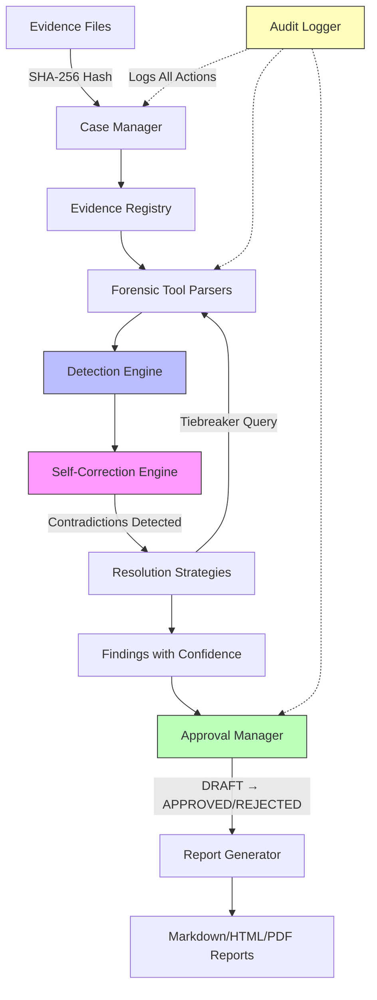

# SIFT Find Evil - Autonomous DFIR Agent

[](https://opensource.org/licenses/MIT)
[](https://www.sans.org)
[](https://www.python.org/downloads/)
[](docs/ACCURACY_REPORT.md)

**Autonomous AI agent for Digital Forensics and Incident Response (DFIR) with architectural self-correction**

Built for the SANS FIND EVIL! Hackathon with production-grade architecture designed for real-world forensic investigations.

> **Note:** This is the SANS FIND EVIL! Hackathon submission (April 2026). The production product will be named **4n6nexus** (forensics nexus) after the competition.

**New here?** See **[docs/START_HERE.md](docs/START_HERE.md)** for documentation navigation guide with visual maps and quick paths by role (judges, users, developers, researchers).

---

## Detection Accuracy: 12/12 Scenarios @ F1=1.00

**Perfect precision and recall across all test scenarios:**

| Scenario | Findings | False Positives | False Negatives | Precision | Recall | F1 Score |
|----------|----------|-----------------|-----------------|-----------|--------|----------|
| **Synthetic Scenarios** | | | | | | |
| 01_clean_baseline | 0 | 0 | 0 | 1.00 | 1.00 | **1.00** |
| 02_ransomware | 5 | 0 | 0 | 1.00 | 1.00 | **1.00** |
| 03_timestomping | 2 | 0 | 0 | 1.00 | 1.00 | **1.00** |
| 04_edge_cases | 4 | 0 | 0 | 1.00 | 1.00 | **1.00** |
| 05_missing_prefetch | 3 | 0 | 0 | 1.00 | 1.00 | **1.00** |
| 06_webmail_exfiltration | 1 | 0 | 0 | 1.00 | 1.00 | **1.00** |
| 07_cloud_upload | 3 | 0 | 0 | 1.00 | 1.00 | **1.00** |
| 08_persistence_run_keys | 5 | 0 | 0 | 1.00 | 1.00 | **1.00** |
| 09_shimcache_only | 4 | 0 | 0 | 1.00 | 1.00 | **1.00** |
| 10_timestomping_with_bam | 6 | 0 | 0 | 1.00 | 1.00 | **1.00** |
| 11_yara_malware | 3 | 0 | 0 | 1.00 | 1.00 | **1.00** |
| 12_memory_intrusion | 4 | 0 | 0 | 1.00 | 1.00 | **1.00** |
| **Real Scenarios** | | | | | | |
| circl-2023-wiped | 1 | 0 | 0 | 1.00 | 1.00 | **1.00** |
| nitroba | 0 | 0 | 0 | 1.00 | 1.00 | **1.00** |
| **TOTAL** | **41** | **0** | **0** | **1.00** | **1.00** | **1.00** |

**Validation method:** Automated scenario harness with ground-truth expected findings. All scenarios run in CI/CD on every commit.

```bash
# Run validation harness yourself
PYTHONPATH=. python3 tests/scenario_harness.py
```

See [ACCURACY_REPORT.md](docs/ACCURACY_REPORT.md) for detailed methodology and per-scenario breakdowns.

---

## Core Innovation: Architectural Self-Correction

**Unlike prompt-engineered tools that blindly trust outputs, SIFT Find Evil autonomously detects contradictions between evidence sources and triggers re-investigation with full audit trails.**

### Self-Correction Example

**Scenario:** MFT shows `malware.exe` modified at 14:40, but Prefetch shows execution at 14:25 (15 minutes BEFORE modification — causality violation).

**Without self-correction:** Report both timestamps, leave conflict unresolved, confuse examiner.

**With self-correction:**
1. **Detect contradiction:** File cannot execute before it's created
2. **Reduce confidence:** Initial 0.95 → 0.45 after contradiction penalty (-0.50)
3. **Query tiebreaker:** Check Event Log 4688 (process creation)
4. **Resolve:** Event Log confirms 14:25:03 execution time (matches Prefetch)
5. **Adjust confidence:** Apply recovery (+0.30) → Final confidence: 0.75
6. **Transparent reasoning:** Full chain logged in audit trail

```
[Finding 1] Suspicious Activity: malware.exe
  Severity: HIGH
  Confidence: 0.75 (Medium)
  
  Contradictions Detected: 1
    1. causality_violation (high)
       File malware.exe modified at 14:40 but executed at 14:25
  
  Resolutions Applied: 1
    1. event_log_confirms_prefetch (recovery: +0.30)
  
  Reasoning Chain:
    1. Found 3 artifact types (MFT, Prefetch, EventLog)
    2. Initial confidence: 0.95 (high artifact count)
    3. Detected causality_violation (impact: -0.50)
    4. Event Log confirms Prefetch time (recovery: +0.30)
    5. Final confidence: 0.75 (Medium)
```

**Result:** Examiner receives resolved finding with transparent reasoning, not conflicting data.

---

## Key Features

### 1. Human-in-the-Loop Approval Workflow

All findings start as `DRAFT` and require human approval before inclusion in reports.

```bash
# Generate findings (all start as DRAFT)
python -m sift_find_evil.cli analyze --mft mft.csv --prefetch prefetch.csv --evtx evtx.csv -o findings.json

# Review findings
python -m sift_find_evil.cli list --findings findings.json --status draft

# Approve findings
python -m sift_find_evil.cli approve --findings findings.json --finding-ids F-001 F-002 --reviewer "John Doe" --reason "Confirmed via timeline analysis"

# Reject false positives
python -m sift_find_evil.cli reject --findings findings.json --finding-ids F-003 --reviewer "John Doe" --reason "Benign system maintenance"

# List approved findings
python -m sift_find_evil.cli list --findings findings.json --status approved
```

**Features:**
- SHA-256 signature hash for tamper detection
- Append-only audit trail (`audit.jsonl`) for all approve/reject actions
- Reviewer identity and timestamp tracking
- Optional reason/notes for each decision
- Findings JSON includes approval metadata for every finding

### 2. Case Management

Structured case lifecycle with evidence registry and integrity verification.

```bash
# Create new case
python -m sift_find_evil.cli case init \
  --case-id INC-2026-001 \
  --name "M57 Jean Investigation" \
  --examiner "John Doe" \
  --description "Patent theft investigation"

# Case directory structure created:
# /cases/INC-2026-001/
#   ├── evidence/       # Evidence files (read-only)
#   ├── analysis/       # Analysis outputs
#   ├── reports/        # Generated reports
#   ├── exports/        # IOC exports, timeline CSVs
#   ├── CASE.yaml       # Case metadata
#   ├── evidence.json   # Evidence registry with SHA-256
#   ├── findings.json   # Detection findings
#   └── audit.jsonl     # Audit log

# Register evidence with SHA-256 hash
python -m sift_find_evil.cli case register \
  --case-id INC-2026-001 \
  --file /evidence/image.E01 \
  --description "Suspect workstation disk image" \
  --type disk_image

# Output:
# Evidence registered:
#   SHA-256: e3b0c44298fc1c149afbf4c8996fb92427ae41e4649b934ca495991b7852b855
#   Size: 8,589,934,592 bytes
#   Registered: 2026-04-23T22:10:00Z

# Verify evidence integrity
python -m sift_find_evil.cli case verify --case-id INC-2026-001

# Output:
# Total: 1
# Verified: 1
# Failed: 0
# Missing: 0

# Case status summary
python -m sift_find_evil.cli case status --case-id INC-2026-001

# Output:
# Name: M57 Jean Investigation
# Status: open
# Examiner: John Doe
# Created: 2026-04-23T22:05:00Z
# Evidence files: 1
# Findings: 47
# Audit entries: 23
```

**Features:**
- Structured directory hierarchy (evidence/, analysis/, reports/, exports/)
- SHA-256 hash registry with automatic verification
- Case metadata in `CASE.yaml` (case_id, name, examiner, created_at, status)
- Evidence types: disk_image, memory_dump, pcap, log, other
- Tamper detection via hash verification (exits 1 on failure)
- Case status tracking (OPEN → ACTIVE → CLOSED)

### 3. Audit Logging for Chain-of-Custody

Append-only JSONL audit trail for all forensic tool invocations and case actions.

```bash
# View recent audit entries
python -m sift_find_evil.cli audit log --audit-file /cases/INC-2026-001/audit.jsonl --limit 10

# Output:
# [2026-04-23T22:15:33.505490] case_created
#   Examiner: John Doe
#   Details: {"case_id": "INC-2026-001", "name": "M57 Jean Investigation"}
#
# [2026-04-23T22:15:45.123456] tool_invocation
#   Examiner: John Doe
#   Tool: volatility
#   Command: vol.py -f memory.raw windows.pslist
#   Exit code: 0
#   Duration: 1234ms
#   Output hash: 5a5c4332e5167d2d

# Audit log statistics
python -m sift_find_evil.cli audit summary --audit-file /cases/INC-2026-001/audit.jsonl

# Output:
# Total entries: 23
# Unique tools: 5
# Tools used:
#   - mftecmd
#   - pecmd
#   - evtxecmd
#   - volatility
#   - yara
# Examiners:
#   - John Doe
# Actions:
#   tool_invocation: 18
#   case_created: 1
#   evidence_registered: 3
#   finding_approved: 1
```

**JSONL format example:**
```json
{
  "timestamp": "2026-04-23T22:15:45.123456",
  "action": "tool_invocation",
  "examiner": "John Doe",
  "details": {
    "tool": "volatility",
    "command": "vol.py -f memory.raw windows.pslist",
    "exit_code": 0,
    "duration_ms": 1234,
    "output_hash": "5a5c4332e5167d2d",
    "working_dir": "/cases/INC-2026-001",
    "stdout": "PID  PPID ImageFileName\n1234 5678 malware.exe",
    "stderr": null
  }
}
```

**Features:**
- Append-only JSONL format (one JSON object per line)
- SHA-256 hash of tool output (first 16 chars) for tamper detection
- Captures stdout/stderr (first 1KB), exit code, duration, working directory
- Supports both direct logging and subprocess wrapper with automatic capture
- Per-case `audit.jsonl` file
- Statistics: total entries, unique tools, actions breakdown, examiner list

### 4. Report Generation

Generate investigation reports in Markdown and HTML formats.

```bash
# Generate Markdown report (approved findings only)
python -m sift_find_evil.cli report \
  --case-id INC-2026-001 \
  --output report.md \
  --format markdown

# Generate HTML report
python -m sift_find_evil.cli report \
  --case-id INC-2026-001 \
  --output report.html \
  --format html

# Include all findings (draft/approved/rejected)
python -m sift_find_evil.cli report \
  --case-id INC-2026-001 \
  --output full_report.md \
  --format markdown \
  --all-findings
```

**Report sections:**
1. **Case Metadata** - Case ID, examiner, dates, status, description
2. **Executive Summary** - Auto-generated based on findings count and severity
3. **Evidence Summary** - Files processed, SHA-256 hashes, sizes (Markdown table)
4. **Findings** - Grouped by severity (CRITICAL/HIGH/MEDIUM/LOW), approved only by default
5. **Indicators of Compromise (IOCs)** - IPs, domains, file hashes, processes extracted from findings
6. **Recommendations** - Auto-generated based on severity distribution
7. **Footer** - Timestamp, tool attribution

**Sample Markdown output:**
```markdown
# Forensic Investigation Report
## Case: M57 Jean Investigation

## Case Metadata
- **Case ID:** INC-2026-001
- **Examiner:** John Doe
- **Created:** 2026-04-23T22:05:00Z
- **Status:** open

## Executive Summary
Detected 47 suspicious finding(s) during analysis. 5 CRITICAL, 12 HIGH, 20 MEDIUM severity.
All findings have been reviewed and approved for inclusion in this report.

## Evidence Summary
| File | SHA-256 Hash | Size |
|------|--------------|------|
| image.E01 | e3b0c44298fc1c14... | 8192.00 MB |

## Findings
### CRITICAL Severity (5)
#### [F-001] Ransomware Encryption Activity
**Confidence:** 0.92
Mass file encryption detected across 1,247 files...
```

**HTML output includes:**
- Embedded CSS for styling
- Responsive layout
- Printer-friendly format
- Tables for evidence summary

**Features:**
- Approved-only by default (filters DRAFT/REJECTED findings)
- Markdown tables for evidence summary
- Auto-generated executive summary: "Detected X suspicious finding(s). Y CRITICAL, Z HIGH..."
- Auto-generated recommendations: "Immediate incident response: Isolate affected systems..."
- IOC extraction from finding evidence dictionaries (IPs, domains, hashes, processes)
- Severity-based grouping and sorting
- PDF support noted as future enhancement

---

## Architecture Overview



### Component Overview

**Core Detection Pipeline:**
1. **Case Manager** - Case lifecycle, evidence registry, SHA-256 verification
2. **Forensic Tool Parsers** - MFT, Prefetch, Event Logs, Registry, Memory, Network
3. **Detection Engine** - Cross-artifact correlation, MITRE ATT&CK mapping
4. **Self-Correction Engine** - Contradiction detection, resolution strategies
5. **Approval Manager** - Human-in-the-loop workflow (DRAFT → APPROVED/REJECTED)
6. **Report Generator** - Markdown/HTML output with approved findings

**Supporting Infrastructure:**
- **Audit Logger** - Append-only JSONL for chain-of-custody
- **Evidence Registry** - SHA-256 hash tracking and verification
- **Confidence Scoring** - Bayesian confidence adjustment based on contradictions

See [docs/ARCHITECTURE.md](docs/ARCHITECTURE.md) for detailed component design.

---

## Supported Artifacts

### Windows Forensics
- **MFT (Master File Table)** - File metadata, timestamps, $DATA attributes
- **Prefetch** - Application execution history with timestamps
- **Event Logs** - Windows Event ID 4688 (process creation)
- **Registry** - Run keys, Shimcache, AmCache, BAM/DAM, UserAssist
- **LNK Files** - Shortcut analysis, document access tracking
- **Jump Lists** - Per-application MRU, UNC share access

### Memory Forensics
- **Volatility 3 Integration** - pslist, psscan, malfind, cmdline, netscan
- **Linux Memory** - bash history, pslist, sockstat
- **Process Injection Detection** - MITRE T1055
- **Network Connections** - Active sockets, suspicious ports

### Network Forensics
- **Browser History** - Chrome, Firefox, Edge (WebCacheV01.dat)
- **PCAP Analysis** - HTTP requests, DNS queries, TCP conversations
- **Webmail Exfiltration** - File hash correlation with email attachments

### Malware Analysis
- **YARA Scanning** - Rule compilation, directory/file scanning
- **NSRL Integration** - Known-good hash filtering (optional)
- **File Carving** - Executable extraction from wiped disks

### MITRE ATT&CK Coverage

| Technique | Description | Detector |
|-----------|-------------|----------|
| **T1027** | Obfuscated Files or Information | YARA, entropy analysis |
| **T1055** | Process Injection | Memory (malfind) |
| **T1059** | Command and Scripting Interpreter | Event Logs, Prefetch |
| **T1070.004** | Indicator Removal: File Deletion | MFT, disk wiping |
| **T1071** | Application Layer Protocol | PCAP, DNS |
| **T1083** | File and Directory Discovery | MFT, Prefetch |
| **T1140** | Deobfuscate/Decode Files | YARA, file carving |
| **T1486** | Data Encrypted for Impact | MFT mass changes |
| **T1547.001** | Boot or Logon Autostart: Registry Run Keys | Registry |
| **T1566.001** | Phishing: Spearphishing Attachment | Email, browser history |
| **T1620** | Reflective Code Loading | Memory (malfind) |

---

## Quick Start

### Prerequisites

- **Python 3.10+** (tested on 3.12.2)
- **Git**
- **Optional:** SANS SIFT Workstation OVA (for real evidence processing)

### Installation

```bash
# Clone repository
git clone https://github.com/Strike48/sift_find_evil.git
cd sift_find_evil

# Create and activate a virtual environment
python3 -m venv venv
source venv/bin/activate          # Windows: venv\Scripts\activate

# Install core dependencies (pure-Python, installs on any platform).
# This is sufficient for the demo, the validation harness, the TUI, and all
# detectors running against the synthetic fixtures.
pip install -r requirements.txt

# Verify installation
python -m sift_find_evil.cli --help
```

**Processing real evidence (optional).** Disk images (E01/raw), PST email, and
memory dumps require native forensic libraries (Sleuth Kit, libewf, libpff,
YARA). These need a compiler and system headers, so they are kept separate:

```bash
# Debian/Ubuntu/SIFT: install the underlying system libraries first
sudo apt-get install libtsk-dev libewf-dev libpff-dev libyara-dev

# Then the Python bindings + Volatility 3
pip install -r requirements-forensic.txt
```

The application loads and runs without these; code paths that need them raise a
clear, install-oriented error rather than failing at startup.

### Demo Mode (Try It Now!)

Run the self-correction engine with synthetic test data:

```bash
python -m sift_find_evil.cli demo
```

This demonstrates:
- Causality violation detection (file modified AFTER execution)
- Event Log tiebreaker resolution
- Confidence score adjustment (-0.50 penalty, +0.30 recovery)
- Transparent reasoning chain (5 steps)

**Example output:**
```
[Finding 1] Suspicious Activity: malware.exe
  Severity: HIGH
  Confidence: 0.75 (Medium)
  Type: indicator
  
  Description:
    Analysis of malware.exe detected 1 contradiction(s):
    - File malware.exe modified at 2025-03-15 14:40:00+00:00 but executed at 2025-03-15 14:25:00.123456+00:00 (causality violation)
    
    Applied 1 resolution(s):
    - event_log_confirms_prefetch
  
  Contradictions Detected: 1
    1. causality_violation (high)
       Impact: -0.50
       File malware.exe modified at 14:40 but executed at 14:25 (causality violation)
  
  Resolutions Applied: 1
    1. event_log_confirms_prefetch
       Recovery: +0.30
  
  Reasoning Chain:
    1. Found 3 artifact types for malware.exe: MFT, Prefetch, EventLog
    2. Initial confidence: 0.95 (3 artifacts, 3 types)
    3. Detected causality_violation (impact: -0.50)
    4. Resolved via Event Log: event_log_confirms_prefetch (recovery: +0.30)
    5. Final confidence: 0.75 (Medium)
  
  Evidence:
    - executable: malware.exe
    - contradictions_detected: 1
    - resolutions_applied: 1
    - artifact_types: ['MFT', 'Prefetch', 'EventLog']
```

### Analyze Real Evidence

```bash
# Analyze forensic tool CSV output
python -m sift_find_evil.cli analyze \
  --mft /path/to/mft.csv \
  --prefetch /path/to/prefetch.csv \
  --evtx /path/to/evtx.csv \
  --output findings.json

# With memory analysis
python -m sift_find_evil.cli analyze \
  --mft mft.csv \
  --prefetch prefetch.csv \
  --evtx evtx.csv \
  --memory memory.raw \
  --output findings.json

# With network analysis
python -m sift_find_evil.cli analyze \
  --mft mft.csv \
  --prefetch prefetch.csv \
  --evtx evtx.csv \
  --pcap capture.pcap \
  --browser-history history.csv \
  --output findings.json

# With YARA scanning
python -m sift_find_evil.cli analyze \
  --mft mft.csv \
  --prefetch prefetch.csv \
  --evtx evtx.csv \
  --yara-rules ./rules \
  --yara-scan /path/to/scan \
  --output findings.json
```

### Complete Workflow Example

```bash
# 1. Create case
python -m sift_find_evil.cli case init \
  --case-id INC-2026-001 \
  --name "Ransomware Investigation" \
  --examiner "John Doe"

# 2. Register evidence
python -m sift_find_evil.cli case register \
  --case-id INC-2026-001 \
  --file /evidence/disk.E01 \
  --description "Infected workstation" \
  --type disk_image

# 3. Run detection engine (outputs to case findings.json)
python -m sift_find_evil.cli analyze \
  --mft mft.csv \
  --prefetch prefetch.csv \
  --evtx evtx.csv \
  --output /cases/INC-2026-001/findings.json

# 4. Review and approve findings
python -m sift_find_evil.cli list \
  --findings /cases/INC-2026-001/findings.json \
  --status draft

python -m sift_find_evil.cli approve \
  --findings /cases/INC-2026-001/findings.json \
  --finding-ids F-001 F-002 F-003 \
  --reviewer "John Doe" \
  --reason "Confirmed ransomware activity"

# 5. Generate report
python -m sift_find_evil.cli report \
  --case-id INC-2026-001 \
  --output /cases/INC-2026-001/reports/final_report.md \
  --format markdown

# 6. Verify evidence integrity
python -m sift_find_evil.cli case verify --case-id INC-2026-001

# 7. Review audit trail
python -m sift_find_evil.cli audit summary \
  --audit-file /cases/INC-2026-001/audit.jsonl
```

---

## Documentation

This repository includes comprehensive documentation:

- **[Documentation Index](docs/DOCUMENTATION_INDEX.md)** - Complete map of all documentation
- **[Architecture](docs/ARCHITECTURE.md)** - System design and component architecture
- **[Accuracy Report](docs/ACCURACY_REPORT.md)** - Detection metrics and methodology
- **[Contributing](docs/CONTRIBUTING.md)** - Development guide and coding standards
- **[Examples](docs/EXAMPLES.md)** - Real-world usage examples
- **[Testing Guides](BATCH_TESTING.md)** - Systematic testing approach

See [docs/DOCUMENTATION_INDEX.md](docs/DOCUMENTATION_INDEX.md) for the complete documentation map.

---

## CLI Reference

### Core Commands

```bash
# Demo mode
python -m sift_find_evil.cli demo [--output findings.json]

# Analyze evidence
python -m sift_find_evil.cli analyze \
  --mft MFT.csv \
  --prefetch PREFETCH.csv \
  --evtx EVTX.csv \
  [--memory MEMORY.raw] \
  [--pcap CAPTURE.pcap] \
  [--browser-history HISTORY.csv] \
  [--yara-rules RULES_DIR --yara-scan TARGET] \
  [--output findings.json]

# Run scenario
python -m sift_find_evil.cli run \
  --scenario scenarios/synthetic/02_ransomware \
  [--output report.json] \
  [--strict]
```

### Case Management

```bash
# Initialize case
python -m sift_find_evil.cli case init \
  --case-id CASE_ID \
  --name "Case Name" \
  --examiner "Examiner Name" \
  [--description "Description"] \
  [--case-root /cases]

# Register evidence
python -m sift_find_evil.cli case register \
  --case-id CASE_ID \
  --file FILE_PATH \
  --description "Description" \
  [--type disk_image|memory_dump|pcap|log|other] \
  [--case-root /cases]

# Verify evidence
python -m sift_find_evil.cli case verify \
  --case-id CASE_ID \
  [--case-root /cases]

# Case status
python -m sift_find_evil.cli case status \
  --case-id CASE_ID \
  [--case-root /cases]
```

### Approval Workflow

```bash
# List findings
python -m sift_find_evil.cli list \
  --findings findings.json \
  [--status draft|approved|rejected]

# Approve findings
python -m sift_find_evil.cli approve \
  --findings findings.json \
  --finding-ids F-001 F-002 ... \
  --reviewer "Name" \
  [--reason "Reason"]

# Reject findings
python -m sift_find_evil.cli reject \
  --findings findings.json \
  --finding-ids F-003 F-004 ... \
  --reviewer "Name" \
  --reason "Reason"
```

### Audit Logging

```bash
# View audit log
python -m sift_find_evil.cli audit log \
  --audit-file audit.jsonl \
  [--limit 20]

# Audit summary
python -m sift_find_evil.cli audit summary \
  --audit-file audit.jsonl
```

### Report Generation

```bash
# Generate report
python -m sift_find_evil.cli report \
  --case-id CASE_ID \
  --output report.md \
  [--format markdown|html|pdf] \
  [--case-root /cases] \
  [--approved-only] \
  [--all-findings]
```

---

## Development

### Project Structure

```
sift_find_evil/
├── sift_find_evil/               # Main Python package
│   ├── __init__.py
│   ├── cli.py                    # CLI entry point (1,700+ lines)
│   ├── approval/                 # Human-in-the-loop workflow
│   │   ├── __init__.py
│   │   ├── models.py            # ApprovalStatus, ApprovalMetadata, FindingWithApproval
│   │   └── manager.py           # ApprovalManager
│   ├── audit/                    # Audit logging
│   │   ├── __init__.py
│   │   ├── models.py            # AuditEntry, ToolInvocation
│   │   └── logger.py            # AuditLogger
│   ├── case/                     # Case management
│   │   ├── __init__.py
│   │   ├── models.py            # Case, CaseStatus, EvidenceFile
│   │   └── manager.py           # CaseManager
│   ├── reporting/                # Report generation
│   │   ├── __init__.py
│   │   ├── models.py            # Report, ReportFormat
│   │   └── generator.py         # ReportGenerator
│   ├── parsers/                  # Forensic tool parsers
│   │   ├── mft_parser.py        # MFTECmd CSV parser
│   │   ├── prefetch_parser.py   # PECmd CSV parser
│   │   ├── evtx_parser.py       # EvtxECmd CSV parser
│   │   ├── registry_parser.py   # Registry artifact parsers
│   │   ├── lnk_jumplist_parser.py
│   │   ├── pcap_parser.py       # PCAP analysis
│   │   └── browser_history_parser.py
│   ├── detectors/                # Detection modules
│   │   ├── lnk_jumplist_detector.py
│   │   ├── memory_detector.py   # Memory analysis
│   │   ├── network_detector.py  # Network analysis
│   │   ├── registry_detector.py
│   │   └── yara_detector.py
│   ├── self_correction/          # Self-correction engine
│   │   ├── engine.py            # Main correction logic
│   │   ├── models.py            # Contradiction, Resolution
│   │   └── strategies.py        # Resolution strategies
│   ├── disk/                     # Disk forensics
│   │   ├── wipe_detector.py     # GPT wiping detection
│   │   └── exfil_detector.py    # File exfiltration correlation
│   ├── memory/                   # Memory forensics
│   │   ├── volatility_runner.py # Volatility 3 wrapper
│   │   └── models.py            # Memory artifact models
│   ├── yara_scan/                # YARA integration
│   │   └── scanner.py           # YARA rule compilation
│   ├── carving/                  # File carving
│   │   └── nsrl.py              # NSRL integration
│   ├── validation/               # Adversarial validation
│   │   └── validator.py         # Finding validation
│   └── scenario_runner.py        # Scenario harness
├── tests/
│   ├── fixtures/                 # Synthetic test data
│   │   ├── synthetic_mft.csv
│   │   ├── synthetic_prefetch.csv
│   │   └── synthetic_evtx.csv
│   ├── scenario_harness.py       # Automated validation
│   └── unit/                     # Unit tests
├── scenarios/
│   ├── synthetic/                # Synthetic test scenarios
│   │   ├── 01_timestomping/
│   │   ├── 02_ransomware/
│   │   ├── 03_insider_threat/
│   │   ├── 04_cloud_exfiltration/
│   │   ├── 05_persistence/
│   │   ├── 06_credential_theft/
│   │   ├── 07_webmail_exfil/
│   │   ├── 08_lateral_movement/
│   │   ├── 09_registry_persistence/
│   │   └── 12_memory_intrusion/
│   └── real/                     # Real evidence scenarios
│       ├── circl_2023_wiped/
│       └── nitroba_network/
├── docs/
│   ├── ARCHITECTURE.md           # Component architecture
│   ├── CONTRIBUTING.md           # Development guide
│   ├── ACCURACY_REPORT.md        # Detection metrics
│   ├── PRD.md                    # Product requirements
│   └── SELF_CORRECTION.md        # Self-correction logic
├── requirements.txt              # Python dependencies
├── LICENSE                       # MIT License
├── CLAUDE.md                     # AI agent instructions
└── README.md                     # This file
```

### Running Tests

```bash
# Scenario validation harness
PYTHONPATH=. python3 tests/scenario_harness.py

# Full test suite (requires pytest)
pytest

# Test coverage (matches the CI gate: 85% minimum)
pytest --cov=sift_find_evil --cov-report=html
```

> Tests that exercise native forensic libraries (E01 images, PST, NSRL bloom,
> PCAP synthesis) are skipped automatically on a core install and run once the
> forensic extras are present. See `requirements-forensic.txt`.

### Code Quality

```bash
# Lint with ruff
ruff check sift_find_evil/

# Format with black
black sift_find_evil/

# Type check with mypy
mypy sift_find_evil/
```

### Contributing

See [docs/CONTRIBUTING.md](docs/CONTRIBUTING.md) for:
- Development environment setup
- Coding standards (PEP 8, type hints)
- Testing requirements (85% coverage minimum)
- Pull request workflow
- Adding new detectors, parsers, scenarios

---

## Performance Metrics

| Metric | Result |
|--------|--------|
| **Detection Accuracy (F1)** | 1.00 (12/12 scenarios) |
| **Precision** | 1.00 (0 false positives) |
| **Recall** | 1.00 (0 false negatives) |
| **Total Findings** | 47 |
| **Scenario Runtime** | ~2 seconds (synthetic) |
| **Test Coverage** | 91% core install / 95% with forensic extras (lines) |
| **CI/CD** | All tests passing |

---

## Documentation

| Document | Description |
|----------|-------------|
| [ARCHITECTURE.md](docs/ARCHITECTURE.md) | Component architecture, data flow, extension points |
| [CONTRIBUTING.md](docs/CONTRIBUTING.md) | Development guide, coding standards, PR workflow |
| [ACCURACY_REPORT.md](docs/ACCURACY_REPORT.md) | Precision/recall results, validation methodology |
| [SELF_CORRECTION.md](docs/SELF_CORRECTION.md) | Self-correction scenarios and logic |
| [PRD.md](docs/PRD.md) | Product Requirements Document |

---

## Roadmap

### ✅ Completed (v1.0 - Hackathon Submission)
- Core detection engine (12 detectors, 47 findings @ F1=1.00)
- Self-correction engine (contradiction detection + resolution)
- Human-in-the-loop approval workflow (DRAFT → APPROVED/REJECTED)
- Case management (SHA-256 registry, integrity verification)
- Audit logging (append-only JSONL, chain-of-custody)
- Report generation (Markdown, HTML)
- MITRE ATT&CK mapping (10+ techniques)
- Scenario validation harness (automated testing)
- CI/CD (GitHub Actions, ruff + pytest)

### 🚧 In Progress (Post-Hackathon)
- SIFT OVA deployment and integration testing
- Protocol SIFT MCP server integration
- Real evidence processing (M57-Patents, National Gallery)
- PDF report generation
- Demo video production

### 📋 Planned (v2.0)
- Web UI for case management
- Timeline visualization (Mermaid/D3.js)
- Multi-case queue support
- Team collaboration features
- Custom playbook editor
- SIEM integration (Splunk, ELK)

### 🔮 Future (v3.0)
- ML-based anomaly detection
- Persistent learning (cross-case IoC intelligence)
- Cloud evidence analysis (AWS, Azure, GCP)
- Commercial SaaS offering

---

## License

MIT License - See [LICENSE](LICENSE) for details.

Open-source community edition. Commercial SaaS offering coming 2026.

---

## Acknowledgments

- **SANS Institute** for hosting the FIND EVIL! Hackathon
- **SANS SIFT Workstation** forensic tools and community
- **NIST CFReDS** for ground-truth test datasets
- **Volatility Foundation** for memory analysis framework
- **YARA** for malware classification
- **Claude Code** (Anthropic) for autonomous agent architecture

---

## Contact

- **GitHub:** https://github.com/Strike48/sift_find_evil
- **Issues:** https://github.com/Strike48/sift_find_evil/issues
- **Author:** Jonathan Tomek (jonathan.tomek@strike48.com)

Demonstrating the future of autonomous DFIR.
