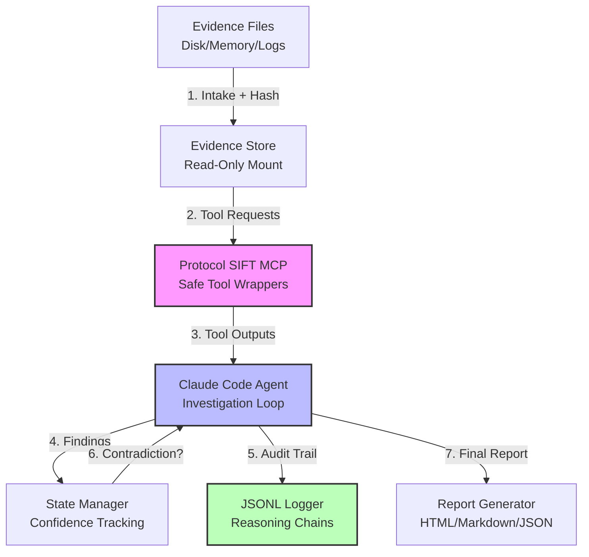
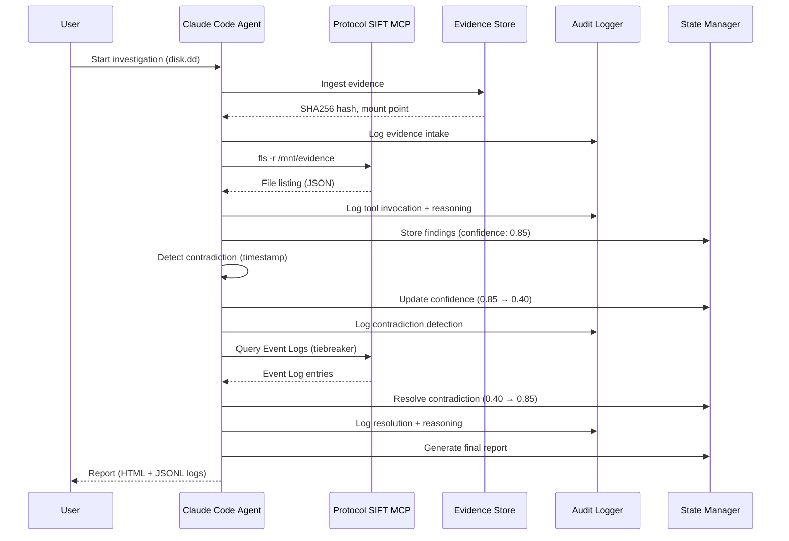

# Architecture & Technical Design

**Status:** Draft  
**Last Updated:** 2026-04-16

This document describes the complete architecture of the SIFT Find Evil autonomous DFIR agent.

---

## Table of Contents

1. [System Overview](#system-overview)
2. [Component Architecture](#component-architecture)
3. [Data Flow](#data-flow)
4. [Architectural Guardrails](#architectural-guardrails)
5. [Self-Correction Engine](#self-correction-engine)
6. [Tool Orchestration](#tool-orchestration)
7. [State Management](#state-management)
8. [Audit & Logging](#audit--logging)
9. [Extensibility](#extensibility)
10. [Technology Stack](#technology-stack)

---

## System Overview

SIFT Find Evil is built as a **Direct Agent Extension** using Claude Code with deep integration into Protocol SIFT MCP for safe, read-only forensic tool execution.

### High-Level Architecture



**Key Design Principles:**
1. **Evidence integrity by architecture** - Read-only enforcement at filesystem and MCP wrapper level
2. **Complete auditability** - Every decision, tool call, and reasoning step logged
3. **Autonomous self-correction** - Architectural mechanisms detect and resolve contradictions
4. **Fail-safe defaults** - Timeouts, circuit breakers, confidence thresholds prevent runaway execution
5. **Extensibility** - Plugin architecture for new tools, playbooks, and correlation techniques

---

## Component Architecture

### 1. Evidence Store

**Purpose:** Secure, immutable storage of forensic evidence with integrity verification.

**Responsibilities:**
- Accept evidence files (disk images, memory dumps, logs, pcaps)
- Compute SHA256 hashes at intake
- Mount disk images read-only (loop device with `ro` flag)
- Prevent any write operations to evidence
- Maintain chain-of-custody metadata

**Implementation:**
- Filesystem-based storage (local or NFS mount)
- Mount utility: `losetup -r` for disk images, `mount -o ro` for filesystems
- Hash verification before analysis starts
- Metadata stored in `cases/<case_id>/metadata.json`

**Interfaces:**
```python
class EvidenceStore:
    def ingest(self, file_path: str, evidence_type: str) -> Evidence
    def mount_readonly(self, evidence_id: str) -> MountPoint
    def verify_integrity(self, evidence_id: str) -> bool
    def get_metadata(self, evidence_id: str) -> dict
```

---

### 2. Protocol SIFT MCP Server

**Purpose:** Safe, auditable wrappers around SIFT forensic tools.

**Responsibilities:**
- Expose SIFT tools (fls, mmls, pf, volatility, etc.) as MCP functions
- Enforce read-only access (block write syscalls)
- Apply timeouts (5 minutes default per tool)
- Log all tool invocations with inputs/outputs
- Handle tool failures gracefully (return error, don't crash)

**Available Tools (MVP):**
- `fls` - File listing (Sleuth Kit)
- `mmls` - Volume/partition listing
- `pf` - Prefetch parser
- `mft` - MFT parser
- `evtx` - Windows Event Log parser
- `grep/awk/sort` - Log analysis utilities

**Future Tools (Post-MVP):**
- `volatility` - Memory analysis (process list, network connections, registry hives)
- `log2timeline` - Super-timeline generation
- `bulk_extractor` - Bulk artifact extraction

**Read-Only Enforcement:**
```python
# MCP wrapper example (pseudocode)
@mcp_tool(name="fls")
def mcp_fls(mount_point: str, options: str = "") -> str:
    # Verify mount point is read-only
    assert is_readonly(mount_point), "Evidence not mounted read-only"
    
    # Apply timeout (5 minutes)
    with timeout(300):
        result = subprocess.run(
            ["fls", options, mount_point],
            capture_output=True,
            check=True
        )
    
    # Log invocation
    audit_log.info("fls executed", mount_point=mount_point, options=options)
    
    return result.stdout.decode()
```

---

### 3. Claude Code Agent (Investigation Loop)

**Purpose:** Autonomous reasoning and investigation orchestration.

**Core Loop:**
```python
def investigation_loop(case_id: str):
    # Phase 1: Triage
    triage_results = triage_phase(case_id)
    hypotheses = generate_hypotheses(triage_results)
    
    # Phase 2: Deep Analysis
    for hypothesis in hypotheses:
        findings = analyze_hypothesis(hypothesis)
        validate_findings(findings)  # Self-correction checkpoint
        
    # Phase 3: Correlation
    timeline = reconstruct_timeline(findings)
    ioc_graph = pivot_iocs(findings)
    
    # Phase 4: Reporting
    report = generate_report(findings, timeline, ioc_graph)
    return report

def validate_findings(findings):
    """Self-correction checkpoint."""
    for finding in findings:
        contradictions = detect_contradictions(finding)
        if contradictions:
            reinvestigate(finding, contradictions)
```

**Key Capabilities:**
- **Hypothesis generation:** Ransomware, insider threat, C2 communication, data exfiltration
- **Tool selection:** Choose appropriate tools based on hypothesis and artifact type
- **Multi-pass analysis:** Initial scan → validation → correlation
- **Confidence tracking:** Score 0.0-1.0 for every finding
- **Reasoning narratives:** Explain why each tool was chosen

---

### 4. State Manager

**Purpose:** Track investigation progress, findings, and confidence scores.

**Schema:**
```python
@dataclass
class Finding:
    id: str
    type: str  # file_hash, process, network_connection, registry_key, etc.
    artifact_type: str  # MFT, Prefetch, EventLog, Memory, etc.
    timestamp: datetime
    confidence: float  # 0.0 - 1.0
    evidence: dict  # Raw tool output
    reasoning: str  # Why this is suspicious
    validated: bool  # Has this been cross-checked?
    
@dataclass
class InvestigationState:
    case_id: str
    status: str  # triage, analyzing, correlating, reporting, complete
    hypotheses: List[Hypothesis]
    findings: List[Finding]
    contradictions: List[Contradiction]
    uncertainty_budget: float  # Cumulative uncertainty score
```

**Persistence:**
- State stored in `cases/<case_id>/state.json`
- Findings indexed by type for fast lookup
- Checkpoint after each analysis phase (resume capability)

---

### 5. Self-Correction Engine

**Purpose:** Detect and resolve contradictions, uncertainty, and tool failures.

**Mechanisms:**

#### 5.1 Cross-Artifact Validation
```python
def detect_timestamp_contradiction(finding: Finding):
    """Example: MFT vs Prefetch timestamp comparison."""
    if finding.type == "file_modification":
        mft_time = finding.evidence["mft_timestamp"]
        
        # Query Prefetch for related executable
        pf_findings = query_findings(type="process_execution", 
                                     path=related_executable(finding.path))
        
        for pf in pf_findings:
            pf_time = pf.evidence["last_run"]
            
            # Causality check: file modified before program ran?
            if mft_time < pf_time:
                return Contradiction(
                    type="timestamp_causality_violation",
                    findings=[finding, pf],
                    confidence_impact=-0.45,  # Drop from 0.85 to 0.40
                    resolution_strategy="query_event_logs_tiebreaker"
                )
```

#### 5.2 Uncertainty Budget
```python
def check_uncertainty_budget(state: InvestigationState):
    """Trigger re-analysis if cumulative uncertainty exceeds threshold."""
    avg_confidence = mean([f.confidence for f in state.findings])
    uncertainty = 1.0 - avg_confidence
    
    if uncertainty > UNCERTAINTY_THRESHOLD (0.25):
        low_confidence_findings = [f for f in state.findings 
                                   if f.confidence < 0.75]
        
        audit_log.warning("Uncertainty budget exceeded",
                         uncertainty=uncertainty,
                         threshold=UNCERTAINTY_THRESHOLD)
        
        reinvestigate_queue.extend(low_confidence_findings)
```

#### 5.3 Circuit Breaker (Tool Failures)
```python
class CircuitBreaker:
    def __init__(self, tool_name: str, max_failures: int = 3):
        self.tool_name = tool_name
        self.failure_count = 0
        self.max_failures = max_failures
        self.disabled = False
    
    def call_tool(self, *args, **kwargs):
        if self.disabled:
            raise ToolDisabledError(f"{self.tool_name} circuit breaker open")
        
        try:
            result = invoke_mcp_tool(self.tool_name, *args, **kwargs)
            self.failure_count = 0  # Reset on success
            return result
        except Exception as e:
            self.failure_count += 1
            audit_log.error(f"{self.tool_name} failed",
                          failure_count=self.failure_count,
                          error=str(e))
            
            if self.failure_count >= self.max_failures:
                self.disabled = True
                audit_log.critical(f"{self.tool_name} circuit breaker opened")
            
            raise
```

---

## Data Flow

### Investigation Flow (Sequence Diagram)



---

## Architectural Guardrails

### 1. Read-Only Enforcement

**Layers of protection:**
1. **Filesystem:** Evidence mounted with `ro` flag
2. **MCP wrappers:** Block write syscalls (seccomp/AppArmor)
3. **Tool invocation:** Never pass write flags to tools
4. **Verification:** Hash comparison before/after analysis

### 2. Timeout Guards

**Defaults:**
- Tool timeout: 5 minutes
- Analysis phase timeout: 30 minutes
- Full investigation timeout: 4 hours

**Rationale:** Prevent hung processes, infinite loops, resource exhaustion.

### 3. Circuit Breakers

**Per-tool failure tracking:**
- 3 consecutive failures → Disable tool
- Log architectural failure for post-mortem
- Fallback to alternative tools when available

### 4. Confidence Thresholds

**Decision gates:**
- <0.50: Flag as low-confidence, require human review
- 0.50-0.75: Medium confidence, continue with caution
- 0.75-0.90: High confidence, proceed autonomously
- >0.90: Very high confidence, include in executive summary

---

## Extensibility

### Plugin Architecture

**Tool Plugins:**
```python
@register_tool_plugin
class VolatilityMemoryPlugin:
    name = "volatility"
    description = "Memory analysis via Volatility 3"
    
    def execute(self, command: str, memory_image: str) -> dict:
        # Implementation
        pass
```

**Playbook Plugins:**
```python
@register_playbook
class RansomwarePlaybook:
    name = "ransomware_investigation"
    triggers = ["ransom_note_detected", "file_encryption_detected"]
    
    def run(self, case_id: str):
        # Step-by-step ransomware investigation
        pass
```

---

## Technology Stack

| Component | Technology | Version |
|-----------|------------|---------|
| **Agent Runtime** | Claude Code (Sonnet 4.6) | Latest |
| **MCP Server** | Protocol SIFT | v0.1.0 |
| **Language** | Python | 3.10+ |
| **Forensic Tools** | SANS SIFT Workstation | Ubuntu 20.04 |
| **Disk Analysis** | Sleuth Kit (fls, mmls) | 4.11+ |
| **Memory Analysis** | Volatility 3 | 2.5.0+ |
| **Log Parsing** | Custom parsers (evtx, CSV) | N/A |
| **Audit Logs** | structlog (JSONL) | 24.1.0+ |
| **State Storage** | JSON files (local FS) | N/A |
| **Reporting** | Jinja2 templates (HTML/MD) | 3.1.0+ |

---

## Deployment Architecture

### Hackathon (MVP)

```
┌─────────────────────────────────┐
│  SANS SIFT Workstation (Ubuntu) │
│                                 │
│  ┌──────────────────────────┐  │
│  │  Claude Code Agent       │  │
│  │  (Python process)        │  │
│  └──────────────────────────┘  │
│              ↓                  │
│  ┌──────────────────────────┐  │
│  │  Protocol SIFT MCP       │  │
│  │  (Python process)        │  │
│  └──────────────────────────┘  │
│              ↓                  │
│  ┌──────────────────────────┐  │
│  │  Evidence Store (local)  │  │
│  │  /evidence/disk.dd       │  │
│  └──────────────────────────┘  │
└─────────────────────────────────┘
```

### Product (Phase 2)

```
┌────────────────────────────────────────┐
│  Web UI (React + FastAPI)             │
└────────────────────────────────────────┘
                 ↓
┌────────────────────────────────────────┐
│  API Gateway (auth, rate limiting)    │
└────────────────────────────────────────┘
                 ↓
┌────────────────────────────────────────┐
│  Orchestration Service (K8s)          │
│  - Claude Code agents (pods)          │
│  - Protocol SIFT MCP (sidecars)       │
└────────────────────────────────────────┘
                 ↓
┌────────────────────────────────────────┐
│  Evidence Storage (S3 / MinIO)        │
└────────────────────────────────────────┘
                 ↓
┌────────────────────────────────────────┐
│  Audit Log Storage (Elasticsearch)    │
└────────────────────────────────────────┘
```

---

*This architecture is designed to win the hackathon and scale to a commercial SaaS offering.*
