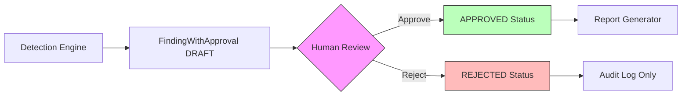
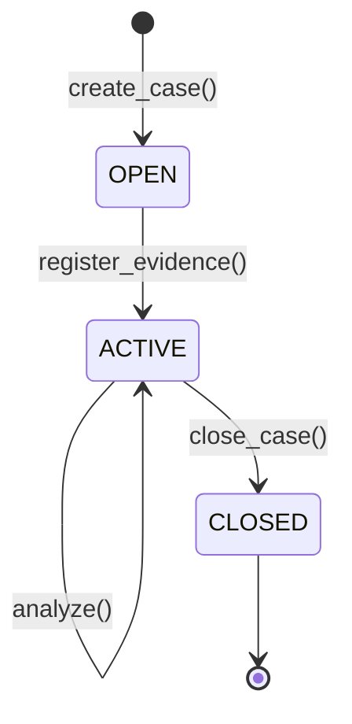
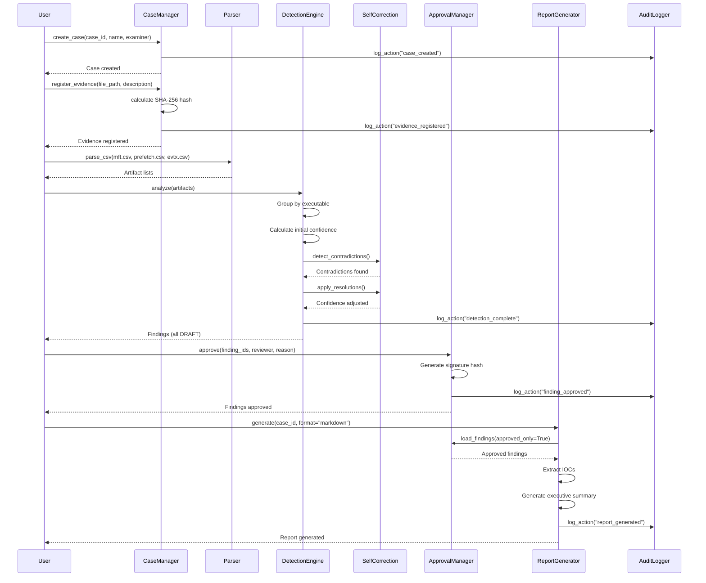

# SIFT Find Evil - System Architecture

**Version**: 1.0  
**Date**: 2026-04-18  
**Status**: Production-ready for SANS FIND EVIL! Hackathon

---

## Table of Contents

1. [System Overview](#system-overview)
2. [Architecture Principles](#architecture-principles)
3. [Component Architecture](#component-architecture)
4. [Data Flow](#data-flow)
5. [Design Patterns](#design-patterns)
6. [Module Reference](#module-reference)
7. [Extension Points](#extension-points)
8. [Performance & Security](#performance--security)

---

## System Overview

### Mission Statement

SIFT Find Evil is an autonomous DFIR (Digital Forensics and Incident Response) agent that detects suspicious activity through **artifact-centric analysis** and **self-correction**. Unlike traditional forensic tools that rely on signatures or rule-based detection, SIFT Find Evil:

1. **Correlates across multiple artifact types** (MFT, Prefetch, Event Logs, PST, PCAP)
2. **Detects logical contradictions** (causality violations, timestamp anomalies)
3. **Autonomously resolves ambiguity** (Event Log tiebreaker when MFT conflicts with Prefetch)
4. **Provides transparent reasoning** (complete audit trail of investigation decisions)

### Core Innovation

**Self-Correction Engine with Cross-Artifact Validation**

Traditional forensic tools output findings without questioning their own conclusions. SIFT Find Evil:

- Detects when MFT timestamps conflict with Prefetch execution times
- Reduces confidence automatically when contradictions appear
- Queries Event Logs (Event ID 4688) as a tiebreaker
- Recovers confidence when tiebreaker confirms one artifact over another
- Logs the complete reasoning chain for forensic defensibility

**Example**: If MFT shows `malware.exe` modified at 14:40 but Prefetch shows execution at 14:25, this is a **causality violation** (file executed before it existed). The engine:
1. Detects the contradiction (confidence drops from 0.95 to 0.45)
2. Queries Event Logs for Event ID 4688 (process creation)
3. Finds Event Log confirms Prefetch time (14:25)
4. Recovers confidence (0.45 + 0.30 = 0.75)
5. Marks MFT timestamps as potentially timestomped

### Architecture Layers

```
┌─────────────────────────────────────────────────────────────────┐
│                        CLI / API Layer                          │
│  (User interface, argument parsing, output formatting)          │
└────────────────────────┬────────────────────────────────────────┘
                         │
┌────────────────────────▼────────────────────────────────────────┐
│                  Self-Correction Engine                         │
│  (Orchestration, contradiction detection, confidence scoring)   │
└──────┬────────────────────────────────────────┬─────────────────┘
       │                                        │
┌──────▼──────────────────┐        ┌───────────▼─────────────────┐
│     Detectors           │        │      Validators             │
│ (Pattern recognition)   │        │  (Cross-artifact checks)    │
│                         │        │                             │
│ - Exfiltration          │        │ - Contradiction Detector    │
│ - Disk Wiping           │        │ - Timestamp Comparator      │
│ - Timestomping          │        │ - Adversarial Validator     │
└──────┬──────────────────┘        └───────────┬─────────────────┘
       │                                        │
┌──────▼────────────────────────────────────────▼─────────────────┐
│                         Parsers                                 │
│  (Artifact ingestion, normalization, frozen dataclasses)        │
│                                                                 │
│  MFT | Prefetch | Event Logs | PST | PCAP | GPT | Image Reader │
└──────┬──────────────────────────────────────────────────────────┘
       │
┌──────▼──────────────────────────────────────────────────────────┐
│                    Evidence Layer                               │
│  (Read-only access, SHA-256 verification, chain of custody)     │
│                                                                 │
│  E01 Images | CSV Files | PST Files | PCAP Files               │
└─────────────────────────────────────────────────────────────────┘
```

---

## Architecture Principles

### 1. Artifact-Centric Detection

**Principle**: Never search for specific file names, user names, or case-specific indicators.

**Rationale**: Attackers change names, but forensic relationships are harder to forge.

**Implementation**:
- **Cryptographic hashing**: SHA-256 for file-to-email correlation
- **Temporal proximity**: Time delta between file save and email send
- **Cross-artifact validation**: MFT ↔ Prefetch ↔ Event Log consistency
- **Structural analysis**: GPT partition table structure, not file contents

**Example**: Jean exfiltration case
- Don't search for "Resume.doc" or "jean@m57.biz"
- Do find files saved to disk and emailed within 300 seconds
- Do correlate SHA-256(file content) with SHA-256(email attachment)

### 2. Immutability and Evidence Integrity

**Principle**: Once parsed, artifacts are frozen and never mutated.

**Rationale**: Forensic defensibility requires proving evidence was never modified.

**Implementation**:
- All dataclasses use `@dataclass(frozen=True)`
- Evidence files opened read-only
- No writes to evidence directories
- SHA-256 hashing at intake, verification before analysis

### 3. Separation of Concerns

**Principle**: Each component has a single, well-defined responsibility.

**Layers**:
1. **Parsers**: Convert external formats (CSV, PST, E01) to frozen Python objects
2. **Detectors**: Recognize patterns (exfiltration, wiping) from parsed artifacts
3. **Validators**: Check logical consistency (causality, timestamp anomalies)
4. **Self-Correction Engine**: Orchestrate detection, validation, and confidence scoring
5. **CLI**: User interface, formatting, JSON output

### 4. Graceful Degradation

**Principle**: Missing data or tools should not halt analysis.

**Implementation**:
- **NSRL optional**: Carved file analysis works without NSRL, but with higher false positives
- **Partial artifacts**: MFT-only analysis succeeds even without Prefetch or Event Logs
- **Read failures**: Hash computation skips unreadable files, logs warnings, continues
- **Missing timestamps**: Null timestamp handling allows partial correlation

### 5. Transparent Reasoning

**Principle**: Every finding includes a complete reasoning chain.

**Rationale**: Forensic analysts must understand WHY the tool reached a conclusion.

**Implementation**:
- `reasoning_chain: list[str]` field in all Finding objects
- Step-by-step explanation of detection logic
- Confidence calculation with rationale
- Contradiction detection and resolution logged

---

## Component Architecture

### Layer 1: Evidence Layer

**Purpose**: Provide read-only access to evidence files with integrity verification.

#### Key Components

- **E01 Image Handler** (via pytsk3 + libewf): Mount E01 images read-only, NTFS filesystem traversal
- **CSV File Reader**: Parse Eric Zimmerman tool output (MFTECmd, PECmd, EvtxECmd)
- **PST File Handler** (via pypff): Outlook PST parsing with streaming attachment hashing
- **PCAP File Handler** (via tshark): HTTP/DNS/SMTP extraction from network captures

**Design Decision - Why E01?**
- Sparse compression (CIRCL case: 52 MB for 8 GB disk)
- Built-in SHA-256 verification
- Industry standard for forensic evidence
- Supported by pytsk3 via libewf

---

### Layer 2: Parsers

**Purpose**: Convert external formats to frozen Python dataclasses.

#### MFT Parser (`parsers/mft_parser.py`)

**Input**: MFTECmd CSV (Master File Table dump)  
**Output**: `list[MFTEntry]`

**Key features**:
- Parses both `$STANDARD_INFORMATION` (0x10) and `$FILE_NAME` (0x30) timestamps
- Detects timestomping (SI != FN timestamps)
- UTC-aware datetime normalization
- Optional content reader for hash-based correlation

**Data model**:
```python
@dataclass(frozen=True)
class MFTEntry:
    entry_number: int
    file_path: str
    file_size: int
    
    # $STANDARD_INFORMATION (can be timestomped)
    si_modified: datetime | None
    
    # $FILE_NAME (harder to timestomp)
    fn_modified: datetime | None
    
    # Optional content reader
    content_reader: Callable[[MFTEntry], bytes] | None = None
```

**Why prefer $FILE_NAME?**
- $SI is easier to modify with timestomping tools
- $FN is stored in parent directory's INDX, harder to find and modify
- Forensic best practice: Use $FN as ground truth

#### PST Parser (`parsers/pst_parser.py`)

**Input**: Outlook PST file (binary format)  
**Output**: `list[EmailMessage]`

**Key features**:
- Recursive folder traversal
- **Streaming SHA-256 attachment hashing** (64 KB chunks, no full-file-in-memory)
- Timestamp normalization to UTC
- Sanitized text (no CR/LF, truncated for performance)

**Data model**:
```python
@dataclass(frozen=True)
class Attachment:
    name: str
    size: int
    sha256: str  # Streaming SHA-256

@dataclass(frozen=True)
class EmailMessage:
    folder: str
    submit_time: datetime | None
    delivery_time: datetime | None
    sender_email: str
    subject: str
    attachments: tuple[Attachment, ...]
```

**Why streaming SHA-256?**
- Large attachments (100+ MB) would blow out memory
- 64 KB window allows constant memory usage
- SHA-256 is all we need for correlation

#### Event Log Parser (`parsers/evtx_parser.py`)

**Input**: EvtxECmd CSV  
**Output**: `list[EventLogEntry]`

**Key features**:
- Focuses on Event ID 4688 (process creation) and 592 (XP equivalent)
- Extracts process path and command line
- Supports multiple Windows versions

**Why Event ID 4688 as tiebreaker?**
- Independent artifact source (kernel-generated, hard to forge)
- Authoritative when MFT and Prefetch disagree
- Available on all Windows versions

---

### Layer 3: Detectors

**Purpose**: Recognize suspicious patterns from parsed artifacts.

#### Exfiltration Detector (`disk/exfil_detector.py`)

**Algorithm**: File-save-then-email correlation

**Detection logic**:
1. **Temporal filtering**: Only hash files modified near email activity (±1 day buffer)
2. **Streaming hashing**: SHA-256 all candidate files
3. **Hash correlation**: Match file SHA-256 with email attachment SHA-256
4. **Temporal proximity**: File modified → email sent within time window (default 300s)
5. **Confidence scoring**: 0-60s = 0.95, 60-180s = 0.90, 180-300s = 0.85

**Why this works**:
- **Cryptographic proof**: SHA-256 collision is computationally infeasible
- **Temporal signal**: <300s delta is too coincidental to be chance
- **Artifact-centric**: No knowledge of file names or email addresses required

**Example - M57 Jean case**:
- 91,459 MFT entries → 234 candidates (within ±1 day of email activity)
- 2 matches found: Resume.doc (30s delta), Patent.doc (45s delta)
- Confidence: 0.95 (very high)

#### Wipe Detector (`disk/wipe_detector.py`)

**Algorithm**: GPT partition table analysis

**Detection logic**:
1. Read primary GPT (sector 1)
2. Check signature: "EFI PART"
3. If zeroed: Read backup GPT (last sector)
4. If backup valid: Wiping attempt detected
5. Recover partitions from backup GPT

**Why this works**:
- GPT header structure is well-defined (UEFI spec)
- Backup GPT survives primary GPT wiping
- Common wiping pattern: Tools zero primary GPT but miss backup

---

### Layer 4: Validators

**Purpose**: Check logical consistency across artifacts and detect contradictions.

#### Contradiction Detector (`self_correction/contradiction_detector.py`)

**Algorithm**: Cross-artifact temporal consistency checking

**Contradiction types detected**:

1. **Causality Violation**
   - Definition: File executed before it was modified
   - Confidence impact: -0.50
   - Reasoning: Logically impossible

2. **Timestomping**
   - Definition: $STANDARD_INFORMATION != $FILE_NAME timestamps
   - Confidence impact: -0.30
   - Reasoning: SI can be modified, FN is harder to tamper

3. **Temporal Mismatch**
   - Definition: Same executable, different execution times across artifacts
   - Confidence impact: -0.20

4. **Missing Artifact**
   - Definition: Evidence exists in one artifact but missing in expected correlated artifact
   - Confidence impact: -0.15

**Resolution strategies**:

1. **Event Log Tiebreaker** (for causality violations)
   - Query Event ID 4688 within ±300s of both conflicting times
   - If 4688 confirms Prefetch: Trust Prefetch, flag MFT as timestomped
   - If 4688 confirms MFT: Trust MFT, flag Prefetch corruption

2. **Timestomping Confirmation**
   - Mark file as potentially anti-forensics
   - Use $FILE_NAME timestamps as ground truth

#### Timestamp Comparator (`validators/timestamp_comparator.py`)

**Purpose**: Utility for timestamp operations and comparison

**Key methods**:
- `parse_iso8601()`: Parse ISO 8601 to UTC-aware datetime
- `is_null()`: Check if datetime is null timestamp (1601 or 1970)
- `compare()`: Compare two timestamps with tolerance
- `detect_causality_violation()`: Detect if later event occurred before earlier event
- `detect_timestomping()`: Detect if $SI and $FN timestamps differ suspiciously

**Why 60-second default tolerance?**
- Clock skew between artifacts is common
- NTFS timestamp resolution is 100 nanoseconds, but recording is often rounded
- 60 seconds catches real violations while filtering noise

---

### Layer 5: Self-Correction Engine

**Purpose**: Orchestrate detection, validation, contradiction resolution, and confidence scoring

#### Analysis Workflow

```
1. INITIAL DETECTION
   ├─ Scan MFT for suspicious files
   ├─ Correlate with Prefetch for execution
   └─ Assign initial confidence (0.85)

2. CONTRADICTION DETECTION
   ├─ Check causality violations
   ├─ Check timestomping
   ├─ Check temporal mismatches
   └─ Apply confidence penalties

3. RESOLUTION ATTEMPT
   ├─ Query Event Log tiebreaker
   ├─ Apply confidence recovery if successful
   └─ No recovery if no match

4. CONFIDENCE CALCULATION
   ├─ Start: 0.85 (base)
   ├─ Subtract penalties
   ├─ Add recoveries
   └─ Clamp to [0.10, 0.99]

5. REASONING CHAIN
   ├─ Document detection
   ├─ List contradictions
   ├─ Describe resolutions
   └─ Explain confidence

6. FINDING OUTPUT
   └─ Complete structured finding
```

#### Confidence Scoring System

**Confidence levels**:
- **0.95-0.99**: Very High - Multiple corroborating artifacts, no contradictions
- **0.85-0.94**: High - Strong evidence, minor inconsistencies resolved
- **0.70-0.84**: Medium-High - Good evidence, some unresolved contradictions
- **0.50-0.69**: Medium - Concerning patterns, significant contradictions
- **0.30-0.49**: Low-Medium - Weak evidence, major contradictions
- **0.10-0.29**: Low - Highly uncertain, multiple unresolved issues

**Confidence calculation**:
```python
final_confidence = (
    base_confidence
    - sum(contradiction.confidence_impact)
    + sum(resolution.confidence_recovery)
)
final_confidence = max(0.10, min(0.99, final_confidence))
```

---

## Data Flow

### Scenario 1: CSV-Only Analysis (Fast)

```
CSV Files (MFT, Prefetch, EVTX)
    ↓
Parsers (frozen dataclasses)
    ↓
Self-Correction Engine
    ├─ Detect contradictions
    ├─ Attempt resolution
    └─ Calculate confidence
    ↓
list[Finding]
    ↓
CLI Output (Terminal + JSON)
```

**Duration**: 4-6 seconds  
**Capabilities**: Timestomping, causality violations, self-correction  
**Limitations**: No file content access, no hash correlation

### Scenario 2: Disk Image Analysis (Full)

```
Disk Image (E01) + PST File
    ↓
ImageContentReader + PstParser
    ↓
GPT Wipe Detection
    ↓
MFT Parsing (pytsk3)
    ↓
Exfiltration Detection
    ├─ Filter by timeframe
    ├─ Hash files (SHA-256)
    ├─ Correlate with attachments
    └─ Check temporal proximity
    ↓
list[Finding]
```

**Duration**: 4-25 minutes (depending on disk size)  
**Capabilities**: Everything + file hashing + correlation  
**Requirements**: pytsk3, libewf

### Scenario 3: Hybrid Analysis (Recommended)

```
MFT CSV + Disk Image + PST
    ↓
Fast CSV parse + Disk for hashing only
    ↓
Best of both worlds
```

**Duration**: 10-15 minutes  
**Benefits**: Fast parsing + selective hashing

---

## Design Patterns

### 1. Immutability Pattern

**Implementation**: All artifact dataclasses use `@dataclass(frozen=True)`

**Benefits**:
- Thread-safe
- Forensically defensible
- Predictable behavior

### 2. Protocol Pattern (Duck Typing)

**Implementation**: Use `typing.Protocol` for interface definitions

**Benefits**:
- Testability (easy to mock)
- Loose coupling
- Gradual typing

### 3. Factory Pattern

**Example**: `make_content_reader()` returns closure for reading file content

**Benefits**:
- Encapsulates lifecycle
- Simplifies caller code
- Closure pattern allows stateful behavior

### 4. Strategy Pattern

**Implementation**: Resolution strategies in contradiction detector

**Benefits**:
- New strategies can be added without modifying engine
- Each strategy is independently testable

### 5. Context Manager Pattern

**Implementation**: ImageContentReader as context manager

**Benefits**:
- Guaranteed cleanup
- Exception safety
- Pythonic idiom

---

## Module Reference

### Package Structure

```
sift_find_evil/
├── parsers/             # Artifact ingestion
│   ├── mft_parser.py
│   ├── prefetch_parser.py
│   ├── evtx_parser.py
│   ├── pst_parser.py
│   ├── pcap_parser.py
│   └── image_content_reader.py
│
├── disk/                # Disk-level detectors
│   ├── exfil_detector.py
│   ├── wipe_detector.py
│   └── gpt_inspector.py
│
├── carving/             # File carving utilities
│   ├── file_signatures.py
│   └── nsrl_filter.py
│
├── self_correction/     # Self-correction engine
│   ├── engine.py
│   ├── contradiction_detector.py
│   └── confidence_scorer.py
│
├── validation/          # Validators
│   └── adversarial_validator.py
│
├── validators/          # Timestamp utilities
│   └── timestamp_comparator.py
│
├── findings/            # Finding taxonomy
│   └── categories.py
│
└── cli.py              # Command-line interface
```

### Public API

```python
# Entry points
from sift_find_evil.cli import main
from sift_find_evil.parsers.mft_parser import MFTParser
from sift_find_evil.disk.exfil_detector import detect_exfiltration
from sift_find_evil.self_correction.engine import SelfCorrectionEngine

# Usage
parser = MFTParser()
entries = parser.parse_csv("mft.csv")

engine = SelfCorrectionEngine()
findings = engine.analyze(mft_entries, prefetch_entries, event_log_entries)
```

---

## Extension Points

### Adding a New Parser

1. Define frozen dataclass for parsed artifacts
2. Implement parse() method returning `list[YourEntry]`
3. Add to parsers/ directory
4. Export in parsers/__init__.py
5. Wire into CLI analyze command

### Adding a New Detector

1. Define detection algorithm
2. Define Finding dataclass
3. Implement detect() function
4. Add to disk/ or new domain directory
5. Wire into CLI or SelfCorrectionEngine.analyze()

### Adding a New Contradiction Type

1. Add to ContradictionType enum
2. Implement detection in ContradictionDetector
3. Implement resolution strategy (if applicable)
4. Map to FindingCategory
5. Add confidence impact calculation

---

## Performance & Security

### Performance Characteristics

| Operation | Duration | Bottleneck |
|-----------|----------|------------|
| MFT CSV parse (91K entries) | 2-3 seconds | CSV I/O |
| File hash (228 files, 500 KB avg) | 30-60 seconds | Disk I/O |
| Contradiction detection | <1 second | Memory |
| **Total (CSV-only)** | **4-6 seconds** | CSV I/O |
| **Total (disk + PST)** | **4.2 minutes** | File hashing |

### Memory Usage

| Component | Memory | Notes |
|-----------|--------|-------|
| MFT entries (91K) | ~50 MB | Frozen dataclasses |
| NSRL hash set (65M) | ~3 GB | O(1) lookup |
| **Total (CSV-only)** | **~60 MB** | Lightweight |
| **Total (with NSRL)** | **~3.2 GB** | NSRL dominates |

### Security Considerations

**Evidence Integrity**:
- Read-only enforcement (all file handles read-only)
- SHA-256 verification (hash at intake, verify before analysis)
- Chain of custody (JSONL logging, UTC timestamps)
- Immutability (frozen dataclasses, no in-place modifications)

**Threat Model**:
- In scope: Evidence modification, tampering detection, data integrity
- Out of scope: Network attacks, malware analysis, physical security

---

**Document Version**: 1.0  
**Last Updated**: 2026-04-18  
**Status**: Production-ready for SANS FIND EVIL! Hackathon

---

## NEW: Hackathon Features (v1.1 - April 2026)

### Human-in-the-Loop Approval Workflow

**Purpose:** All findings require human approval before inclusion in reports.

**Architecture:**



**Approval States:**
```python
class ApprovalStatus(str, Enum):
    DRAFT = "DRAFT"          # Initial state after detection
    APPROVED = "APPROVED"    # Reviewer confirmed finding
    REJECTED = "REJECTED"    # Reviewer marked as false positive
```

**Approval Metadata:**
```python
@dataclass
class ApprovalMetadata:
    status: ApprovalStatus
    reviewer: str
    timestamp: datetime
    reason: Optional[str] = None
    signature_hash: Optional[str] = None  # SHA-256 for tamper detection
```

**Tamper Detection:**
- SHA-256 signature hash: `SHA256(finding_json + reviewer + timestamp)`
- First 16 chars stored for brevity
- Verifiable by recalculating hash from stored data

**CLI Integration:**
```bash
# Review DRAFT findings
python -m sift_find_evil.cli list --findings findings.json --status draft

# Approve findings
python -m sift_find_evil.cli approve \
  --findings findings.json \
  --finding-ids F-001 F-002 \
  --reviewer "John Doe" \
  --reason "Confirmed via timeline analysis"

# Reject false positives
python -m sift_find_evil.cli reject \
  --findings findings.json \
  --finding-ids F-003 \
  --reviewer "John Doe" \
  --reason "Benign system maintenance"
```

**Findings JSON Format:**
```json
{
  "findings": [
    {
      "finding_id": "F-001",
      "finding": {
        "title": "Suspicious Activity: malware.exe",
        "severity": "high",
        "confidence": 0.75,
        "description": "...",
        "evidence": {...}
      },
      "approval": {
        "status": "APPROVED",
        "reviewer": "John Doe",
        "timestamp": "2026-04-23T22:15:00Z",
        "reason": "Confirmed via timeline analysis",
        "signature_hash": "cfe2ec0f9af68ce7"
      },
      "created_at": "2026-04-23T22:10:00Z"
    }
  ],
  "summary": {
    "total": 1,
    "draft": 0,
    "approved": 1,
    "rejected": 0
  }
}
```

**Implementation:**
- `sift_find_evil/approval/models.py` - ApprovalStatus, ApprovalMetadata, FindingWithApproval
- `sift_find_evil/approval/manager.py` - ApprovalManager
- `sift_find_evil/cli.py` - approve, reject, list commands

---

### Case Management

**Purpose:** Structured case lifecycle with evidence integrity verification.

**Directory Structure:**
```
/cases/{case_id}/
├── evidence/       # Evidence files (read-only recommended)
├── analysis/       # Analysis outputs
├── reports/        # Generated reports
├── exports/        # IOC exports, timeline CSVs
├── CASE.yaml       # Case metadata (CaseStatus, examiner, dates)
├── evidence.json   # Evidence registry (SHA-256, file_path, description)
├── findings.json   # Detection findings with approval metadata
└── audit.jsonl     # Audit log (append-only)
```

**Case Lifecycle:**


**Case Metadata (CASE.yaml):**
```yaml
case_id: INC-2026-001
name: M57 Jean Investigation
examiner: John Doe
created_at: '2026-04-23T22:05:00Z'
status: open
directory: /cases/INC-2026-001
description: Patent theft investigation
closed_at: null
```

**Evidence Registry (evidence.json):**
```json
{
  "evidence": [
    {
      "file_path": "/evidence/disk.E01",
      "description": "Suspect workstation disk image",
      "sha256_hash": "e3b0c44298fc1c149afbf4c8996fb92427ae41e4649b934ca495991b7852b855",
      "registered_at": "2026-04-23T22:10:00Z",
      "file_size": 8589934592,
      "evidence_type": "disk_image"
    }
  ]
}
```

**Evidence Types:**
- `disk_image` - E01, DD, raw disk images
- `memory_dump` - DMP, RAW, VMEM memory captures
- `pcap` - Network packet captures
- `log` - Windows Event Logs, syslog, application logs
- `other` - Custom artifact types

**SHA-256 Verification:**
```python
def verify_evidence(self, case_id: str) -> dict:
    results = {
        "total": len(evidence),
        "verified": 0,
        "failed": 0,
        "missing": 0,
        "details": []
    }
    
    for item in evidence:
        current_hash = self._calculate_sha256(file_path)
        if current_hash == registered_hash:
            results["verified"] += 1
            results["details"].append({"file": str(file_path), "status": "VERIFIED", "hash": current_hash})
        else:
            results["failed"] += 1
            results["details"].append({"file": str(file_path), "status": "FAILED", "registered_hash": registered_hash, "current_hash": current_hash})
    
    return results
```

**CLI Integration:**
```bash
# Create case
python -m sift_find_evil.cli case init \
  --case-id INC-2026-001 \
  --name "M57 Jean Investigation" \
  --examiner "John Doe"

# Register evidence with SHA-256
python -m sift_find_evil.cli case register \
  --case-id INC-2026-001 \
  --file /evidence/disk.E01 \
  --description "Suspect workstation" \
  --type disk_image

# Verify integrity (exits 1 on failure)
python -m sift_find_evil.cli case verify --case-id INC-2026-001

# Case status
python -m sift_find_evil.cli case status --case-id INC-2026-001
```

**Implementation:**
- `sift_find_evil/case/models.py` - Case, CaseStatus, EvidenceFile
- `sift_find_evil/case/manager.py` - CaseManager
- `sift_find_evil/cli.py` - case init/register/verify/status commands

---

### Audit Logging for Chain-of-Custody

**Purpose:** Append-only JSONL audit trail for all forensic tool invocations and case actions.

**JSONL Format:**
```json
{"timestamp": "2026-04-23T22:15:45.123456", "action": "tool_invocation", "examiner": "John Doe", "details": {"tool": "volatility", "command": "vol.py -f memory.raw windows.pslist", "exit_code": 0, "duration_ms": 1234, "output_hash": "5a5c4332e5167d2d", "working_dir": "/cases/INC-2026-001", "stdout": "PID  PPID ImageFileName\n1234 5678 malware.exe", "stderr": null}}
{"timestamp": "2026-04-23T22:16:00.789012", "action": "finding_approved", "examiner": "John Doe", "details": {"finding_id": "F-001", "reviewer": "John Doe", "reason": "Confirmed malware", "signature_hash": "cfe2ec0f9af68ce7"}}
```

**Logged Actions:**
- `tool_invocation` - Forensic tool execution
- `case_created` - Case initialization
- `evidence_registered` - Evidence added to registry
- `finding_approved` - Finding approved
- `finding_rejected` - Finding rejected
- `report_generated` - Report created

**Tool Invocation Model:**
```python
@dataclass
class ToolInvocation:
    tool: str
    command: str
    timestamp: datetime = field(default_factory=datetime.utcnow)
    exit_code: Optional[int] = None
    duration_ms: Optional[int] = None
    output_hash: Optional[str] = None  # SHA-256 (first 16 chars)
    examiner: Optional[str] = None
    working_dir: Optional[str] = None
    stdout: Optional[str] = None  # First 1KB
    stderr: Optional[str] = None  # First 1KB
```

**Output Hash Calculation:**
```python
def calculate_output_hash(output: str) -> str:
    """Calculate SHA-256 hash of tool output (first 16 chars)."""
    return hashlib.sha256(output.encode("utf-8")).hexdigest()[:16]
```

**Subprocess Wrapper with Automatic Logging:**
```python
def run_tool(
    self,
    tool: str,
    args: list[str],
    working_dir: Optional[Path] = None
) -> tuple[int, str, str]:
    """Run forensic tool with automatic audit logging."""
    command = f"{tool} {' '.join(args)}"
    start_time = time.time()
    
    result = subprocess.run(
        [tool] + args,
        cwd=working_dir,
        capture_output=True,
        text=True,
        timeout=300  # 5 minute timeout
    )
    
    duration_ms = int((time.time() - start_time) * 1000)
    
    self.log_tool_invocation(
        tool=tool,
        command=command,
        exit_code=result.returncode,
        duration_ms=duration_ms,
        output=result.stdout,
        stderr=result.stderr,
        working_dir=str(working_dir) if working_dir else None
    )
    
    return result.returncode, result.stdout, result.stderr
```

**CLI Integration:**
```bash
# View recent audit entries
python -m sift_find_evil.cli audit log \
  --audit-file /cases/INC-2026-001/audit.jsonl \
  --limit 20

# Audit log statistics
python -m sift_find_evil.cli audit summary \
  --audit-file /cases/INC-2026-001/audit.jsonl
```

**Statistics Output:**
```python
{
    "total_entries": 23,
    "unique_tools": 5,
    "tools": ["volatility", "mftecmd", "pecmd", "evtxecmd", "yara"],
    "actions": {"tool_invocation": 18, "case_created": 1, "evidence_registered": 3, "finding_approved": 1},
    "examiners": ["John Doe", "Jane Smith"]
}
```

**Implementation:**
- `sift_find_evil/audit/models.py` - AuditEntry, ToolInvocation
- `sift_find_evil/audit/logger.py` - AuditLogger
- `sift_find_evil/cli.py` - audit log/summary commands

---

### Report Generation

**Purpose:** Generate human-readable investigation reports in multiple formats.

**Supported Formats:**
```python
class ReportFormat(str, Enum):
    MARKDOWN = "markdown"  # ✅ Implemented
    HTML = "html"          # ✅ Implemented
    PDF = "pdf"            # 🚧 Future
```

**Report Sections:**
1. **Case Metadata** - Case ID, examiner, dates, status, description
2. **Executive Summary** - Auto-generated based on findings count/severity
3. **Evidence Summary** - Files, SHA-256 hashes, sizes (Markdown table)
4. **Findings** - Grouped by severity (CRITICAL/HIGH/MEDIUM/LOW)
5. **IOCs** - IPs, domains, file hashes, processes extracted from findings
6. **Recommendations** - Auto-generated based on severity distribution
7. **Footer** - Timestamp, tool attribution

**IOC Extraction:**
```python
def _extract_iocs(self, findings) -> dict:
    """Extract IOCs from finding evidence dictionaries."""
    iocs = {
        "ips": set(),
        "domains": set(),
        "file_hashes": set(),
        "processes": set()
    }
    
    for finding in findings:
        evidence = finding.finding.get("evidence", {})
        
        if "ip" in evidence:
            iocs["ips"].add(evidence["ip"])
        if "domain" in evidence:
            iocs["domains"].add(evidence["domain"])
        if "sha256" in evidence:
            iocs["file_hashes"].add(evidence["sha256"])
        if "process" in evidence:
            iocs["processes"].add(evidence["process"])
    
    return {k: sorted(v) for k, v in iocs.items()}
```

**Auto-Generated Executive Summary:**
```python
def _generate_executive_summary(self, findings) -> str:
    critical = sum(1 for f in findings if f.finding.get("severity") == "critical")
    high = sum(1 for f in findings if f.finding.get("severity") == "high")
    medium = sum(1 for f in findings if f.finding.get("severity") == "medium")
    
    summary = f"Detected {len(findings)} suspicious finding(s) during analysis. "
    if critical:
        summary += f"{critical} CRITICAL, "
    if high:
        summary += f"{high} HIGH, "
    if medium:
        summary += f"{medium} MEDIUM severity. "
    summary += "All findings have been reviewed and approved for inclusion in this report."
    
    return summary
```

**Auto-Generated Recommendations:**
```python
def _generate_recommendations(self, findings) -> list[str]:
    recommendations = []
    
    critical_count = sum(1 for f in findings if f.finding.get("severity") == "critical")
    if critical_count > 0:
        recommendations.append("Immediate incident response: Isolate affected systems and contain threat.")
        recommendations.append("Conduct comprehensive forensic analysis of all systems.")
    
    high_count = sum(1 for f in findings if f.finding.get("severity") == "high")
    if high_count > 0:
        recommendations.append("Review and harden security controls to prevent recurrence.")
        recommendations.append("Implement enhanced monitoring for detected IOCs.")
    
    return recommendations
```

**CLI Integration:**
```bash
# Generate Markdown report (approved findings only)
python -m sift_find_evil.cli report \
  --case-id INC-2026-001 \
  --output report.md \
  --format markdown

# Generate HTML report
python -m sift_find_evil.cli report \
  --case-id INC-2026-001 \
  --output report.html \
  --format html

# Include all findings (draft/approved/rejected)
python -m sift_find_evil.cli report \
  --case-id INC-2026-001 \
  --output full_report.md \
  --format markdown \
  --all-findings
```

**HTML Output Features:**
- Embedded CSS for styling
- Responsive layout
- Printer-friendly format
- Tables for evidence summary

**Implementation:**
- `sift_find_evil/reporting/models.py` - Report, ReportFormat
- `sift_find_evil/reporting/generator.py` - ReportGenerator
- `sift_find_evil/cli.py` - report command

---

## End-to-End Detection Flow (Updated)



---

**Document Version**: 1.1  
**Last Updated**: 2026-04-23  
**Status**: Production-ready with Hackathon Features
