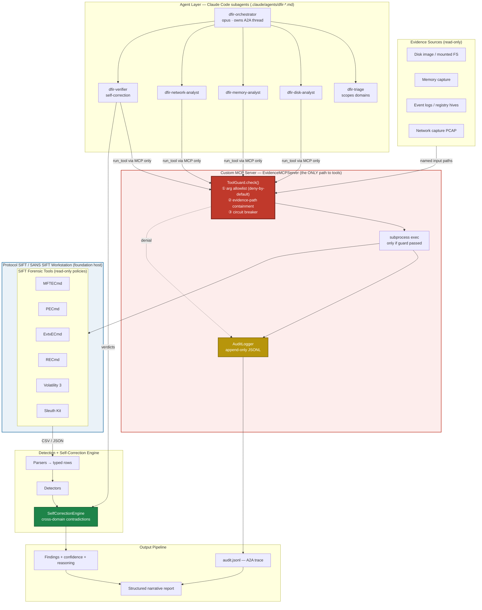
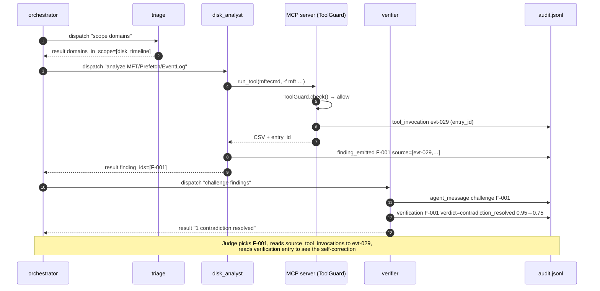
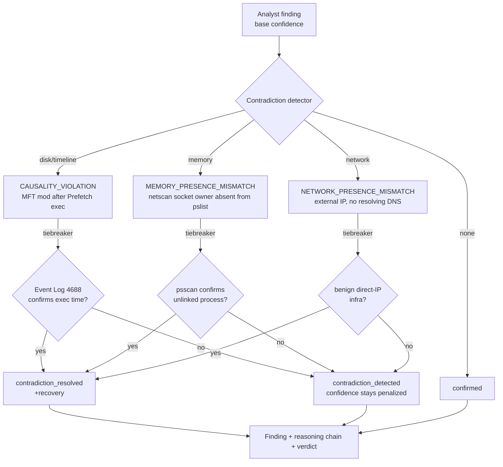

# Architecture Diagram — SIFT Find Evil (Multi-Agent DFIR)

> FIND EVIL! Deliverable #3. This document is the source-of-truth architecture
> for the multi-agent system. It identifies the architectural pattern, shows how
> every component connects (agents, SIFT tools, MCP server, evidence sources,
> output pipeline), and — per judging criterion #4 (Constraint Implementation) —
> **explicitly separates architectural guardrails from prompt-based controls and
> marks where each security boundary is enforced.**

## Architectural pattern

**Multi-Agent Framework over a Custom MCP Server.**

- **Multi-Agent Framework** — a Claude Code orchestrator subagent dispatches five
  specialist subagents (triage, three domain analysts, a verifier). Definitions
  live in `.claude/agents/dfir-*.md`. Agents communicate by agent-to-agent (A2A)
  messages recorded on a single correlated audit thread.
- **Custom MCP Server** — `sift_find_evil/mcp/server.py` (`EvidenceMCPServer`) is
  the single chokepoint every forensic-tool call crosses. The architectural
  guardrails live *here*, in code, not in any agent prompt.

These two named approaches (from the hackathon's "Architecture Approaches" list)
are composed: the multi-agent framework is the execution engine; the Custom MCP
server is the enforcement boundary beneath it.

## Foundation: Protocol SIFT / SIFT Workstation

This system is an **extension of Protocol SIFT**, not a replacement. Everything
above runs *on top of* the SANS SIFT Workstation environment and drives its
court-vetted forensic tool library. The layering, bottom to top:

```
┌──────────────────────────────────────────────────────────────────┐
│  SIFT Find Evil (this submission)                                  │
│    Multi-Agent Framework  ─ orchestrator + triage + 3 analysts +   │
│                             verifier (self-correction)             │
│    Custom MCP Server      ─ EvidenceMCPServer + ToolGuard          │
│                             (architectural evidence-integrity)     │
├──────────────────────────────────────────────────────────────────┤
│  Protocol SIFT / SANS SIFT Workstation (foundation)                │
│    Forensic tool library  ─ MFTECmd, PECmd, EvtxECmd, RECmd,       │
│                             Volatility 3, Sleuth Kit, …            │
│    Linux host + evidence mounts (read-only)                        │
│    [Claude Code agent loop — used by the interactive path]         │
└──────────────────────────────────────────────────────────────────┘
```

**What Protocol SIFT provides (foundation):** the SIFT Workstation host, the
forensic tool binaries, evidence mounts, and — for the interactive path — the
Claude Code agent loop our subagents plug into.

**What SIFT Find Evil adds (this submission):** the multi-agent decomposition,
the self-correction engine, confidence scoring with reasoning chains, and the
Custom MCP server that turns "the agent *should not* spoliate evidence" (a SIFT
operator convention) into "the agent *cannot*" (a code-enforced boundary).

The Custom MCP server sits *between* the agents and the SIFT tools precisely so
that the evidence-integrity guarantee does not depend on the foundation's
permission model or on prompt discipline — it is enforced in our boundary code.

---

## System architecture



**Foundation (blue).** The `Protocol SIFT / SANS SIFT Workstation` subgraph is the
host environment this submission extends: it supplies the forensic tool binaries
and read-only evidence mounts. SIFT Find Evil's agent layer and MCP boundary sit
above it; the MCP server is the only path from the agents down into the SIFT tools.

**Trust boundary (red).** The MCP server is a hard trust boundary. Agents hold
no tool binaries and no filesystem write path to evidence; their *only* way to
touch a forensic tool is `EvidenceMCPServer.run_tool()`, which calls
`ToolGuard.check()` before any subprocess runs. Constraints are therefore
**structural** — an agent cannot route around them, regardless of what its prompt
says or how it is jailbroken.

---

## Guardrail taxonomy — architectural vs prompt-based

This is the criterion-#4 distinction stated plainly. Architectural controls are
enforced in code at a boundary the agent cannot bypass; prompt-based controls are
instructions to the model that *reduce* bad behavior but cannot *prevent* it.

| Control | Type | Enforced where (file) | Bypass-tested? |
|---|---|---|---|
| Read-only on evidence (no write/modify flag reachable) | **Architectural** | `mcp/guardrails.py` `ToolGuard._check_args` + `mcp/server.py` `default_policies` (per-tool arg allowlist, deny-by-default) | Yes — see Accuracy Report bypass section |
| Evidence-path containment (no reads outside evidence root, no traversal) | **Architectural** | `mcp/guardrails.py` `_check_path_contained` | Yes — `/etc/shadow` read attempt is denied + audited |
| Circuit breaker (N consecutive failures opens boundary) | **Architectural** | `mcp/guardrails.py` `circuit_open` / `record_failure` | Yes — unit-tested in `tests/test_mcp_guardrails.py` |
| Tool allowlist (unknown tool rejected) | **Architectural** | `mcp/guardrails.py` `check()` (`policies.get(tool) is None` → reject) | Yes |
| Every tool call audited (finding → tool-execution trace) | **Architectural** | `mcp/server.py` `run_tool` always logs via `AuditLogger` | Yes — trace reconstructed by `AuditLogger.trace()` |
| Agents have no shell / no direct binary access (only path to tools is the MCP server) | **Architectural** | `.claude/agents/dfir-*.md` `tools:` allowlists grant only `Read`/`Grep`/`Glob` + `mcp__sift-find-evil__*` (analysts/verifier) or `Agent` (orchestrator); no `Bash`/`Write`/`Edit` | Yes — Claude Code enforces the subagent tool allowlist; standalone agents are Python classes with no shell |
| "Emit a finding ONLY when grounded in tool output; no fabrication" | **Prompt-based** | each `.claude/agents/dfir-*.md` analyst | Backed by audit trace + verifier challenge |
| "Distinguish confirmed observation from inference" | **Prompt-based** | analyst agent definitions | Backed by confidence scoring + reasoning chain |

**Design stance:** prompt-based controls are *defense in depth on top of* the
architectural boundary, never the primary control. The anti-fabrication and
read-only **guarantees** rest on code (the MCP guard + the audit trail + the
verifier's self-correction), so they hold even if an agent ignores its prompt.
The agents are not merely *told* not to call binaries directly — their tool
allowlists grant no shell (`Bash`) and no write tools (`Write`/`Edit`) at all, so
the only execution path to a forensic tool is the MCP server. An agent that
"wanted" to bypass the boundary has no tool with which to do so, in either the
Claude Code path (allowlist enforced by the runtime) or the standalone path
(agents are Python classes with no shell).

### Where the architectural guarantee comes from (deny-by-default)

`default_policies()` lists, per tool, the *complete* set of flags a tool may run
with. No write/modify/delete flag is listed for any tool, so write operations are
not "blocked by a denylist" — they are **unreachable**, because anything not on
the allowlist is rejected:

```text
ToolGuard.check(tool, args):
  circuit_open?          → CircuitBreakerOpen        (deny)
  tool not in policies?  → GuardrailViolation        (deny — unknown tool)
  for each arg:
    flag not in allowed_flags?      → GuardrailViolation   (deny — e.g. --write)
    path flag's value outside root? → GuardrailViolation   (deny — traversal/abs)
  → return (allow; only now does subprocess run)
```

A denial is itself an audited event (`action: tool_blocked`), stamped with the
acting agent and correlation id — so an *attempted* bypass is visible in the
trace, not silently dropped.

---

## A2A audit sequence (how a judge traces a finding)

Every message, tool call, finding, and verification lands on one append-only
JSONL thread keyed by `correlation_id`. This is the literal
"trace-any-finding-to-its-tool-execution" path the rubric requires.



A blocked call (e.g. `volatility -f /etc/shadow …`) appears on the same thread as
`action: tool_blocked` with the `GuardrailViolation` reason — the bypass attempt
is part of the auditable record.

Reproduce the full thread:

```bash
python -m sift_find_evil.orchestration --bypass-demo
# then: AuditLogger("analysis/demo_run/audit.jsonl").trace("F-001")
```

---

## Cross-domain self-correction

The verifier challenges every analyst finding through the
`SelfCorrectionEngine`. Each domain has a contradiction type and a tiebreaker that
can *resolve* (recover confidence on) the contradiction with a second source.



Domains map to the A2A `verification.domain` field
(`disk_timeline` / `memory` / `network`). **All three are exercised end-to-end by
the reproducible harness** (`python -m sift_find_evil.orchestration`): the
disk/timeline tiebreaker (Event Log 4688), the memory tiebreaker (a hidden
process present in psscan but not pslist, resolved via psscan), and the network
tiebreaker (a hardcoded-IP C2 conversation that stays detected alongside a
benign direct-IP hit that resolves) all emit `verification` records on one
correlated A2A log. The contradiction types are implemented in
`SelfCorrectionEngine.analyze` (SFE-11v / SFE-q41) and unit-tested.

---

## Component responsibilities

### Agent layer (`.claude/agents/dfir-*.md`)

| Agent | Model | Role |
|---|---|---|
| `dfir-orchestrator` | opus | Opens case, mints `correlation_id`, dispatches, owns A2A log. Does not analyze evidence itself. |
| `dfir-triage` | sonnet | Enumerates artifacts, scopes which domains are in play. |
| `dfir-disk-analyst` | sonnet | MFT, Prefetch, LNK/JumpLists, registry, shimcache/BAM, timestomping. Largest detector cluster. |
| `dfir-memory-analyst` | sonnet | Volatility plugins: pslist/psscan, malfind, netscan, cmdline. |
| `dfir-network-analyst` | sonnet | PCAP: exfil ratio, beaconing, DNS anomalies. |
| `dfir-verifier` | opus | Challenges findings via the self-correction engine; resolves contradictions before reporting. |

### Custom MCP server (`sift_find_evil/mcp/`)

- `server.py` `EvidenceMCPServer.run_tool()` — validate → execute → audit. The
  transport-independent dispatch core; `build_fastmcp()` registers it as real MCP
  tools over the official SDK for live agent use.
- `guardrails.py` `ToolGuard` — the three architectural controls.
- `server.py` `default_policies()` — six read-only tool policies.

### Detection + self-correction engine (`sift_find_evil/`)

- Parsers normalize tool output into typed rows.
- Detectors emit candidate findings with MITRE ATT&CK mapping and confidence.
- `SelfCorrectionEngine` detects and resolves cross-domain contradictions, then
  the `verifier_adapter` expresses each result as an A2A `Verification` record.

### Output pipeline

- `findings` — title, category, severity, confidence, reasoning chain, artifact
  refs, `source_tool_invocations`.
- `audit.jsonl` — single correlated A2A thread (messages, tool calls, findings,
  verifications, blocks).
- Structured narrative report (investigative story, not a raw execution log).

---

## Technology stack

| Layer | Technology |
|---|---|
| Agent framework | Claude Code subagents (orchestrator + 5 specialists) |
| Tool boundary | Custom MCP server (`EvidenceMCPServer`) + official MCP SDK (`build_fastmcp`) |
| Forensic tools | MFTECmd, PECmd, EvtxECmd, RECmd, Volatility 3, Sleuth Kit (read-only policies) |
| Platform | SANS SIFT Workstation (Linux terminal) |
| Language | Python 3.12 |
| Audit | Append-only JSONL, UTC, per-investigation `correlation_id` |
| Validation | pytest; scenario harness holds F1 = 1.00 across all scenarios |
| License | MIT (open source) |

---

## Honest scope note (for judges)

- The **architectural guardrails, audit trail, and all three domain self-
  correction types** are implemented and tested in code.
- The **reproducible orchestration harness** (`python -m sift_find_evil.orchestration`)
  drives **all three domains** (disk/timeline, memory, network) end-to-end
  against the demo scenario, emitting one correlated A2A log with six findings
  and self-correction round-trips in each domain — including a network case that
  stays *detected* (hardcoded-IP C2) next to one that *resolves* (benign
  direct-IP), plus an optional audited guardrail-bypass attempt.
- The live recorded demo uses the real Claude Code subagents against the same MCP
  server; the in-process harness guarantees the identical-every-time artifact
  behind that demo.

---

## Rendering / export

This file uses Mermaid, which GitHub renders natively. To export images:

```bash
npm install -g @mermaid-js/mermaid-cli
mmdc -i docs/ARCHITECTURE_DIAGRAM.md -o architecture.png
```

Or paste a single diagram block into https://mermaid.live/ and export PNG/SVG.
