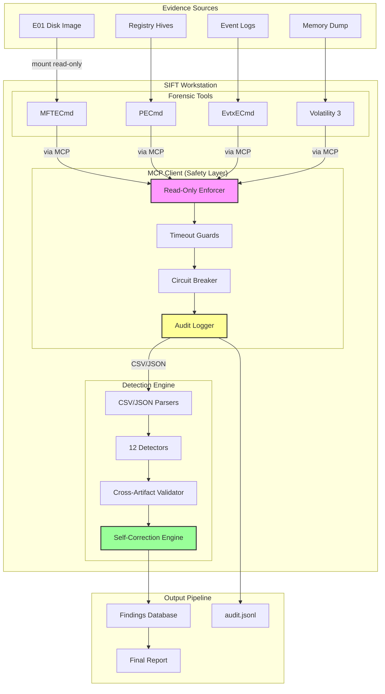
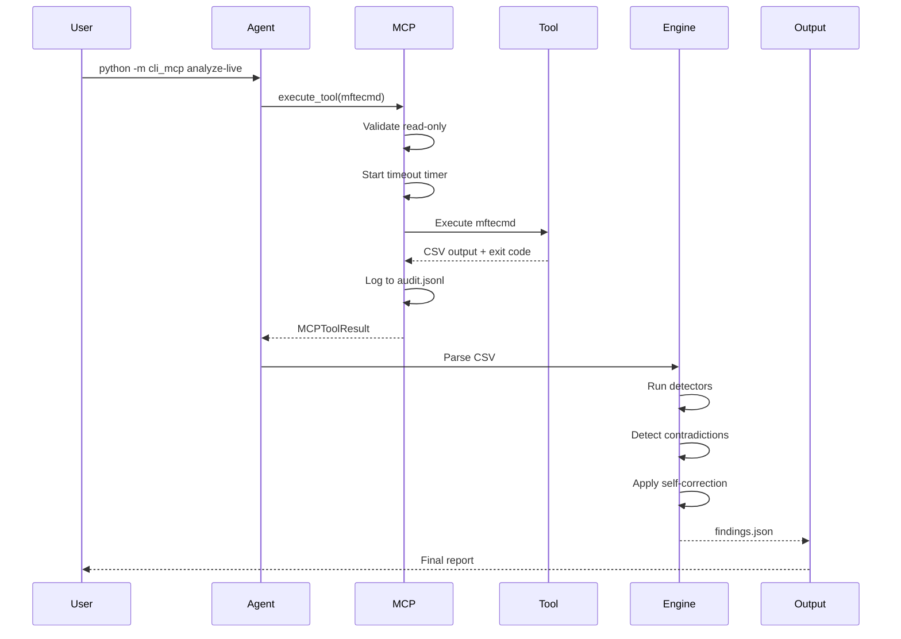
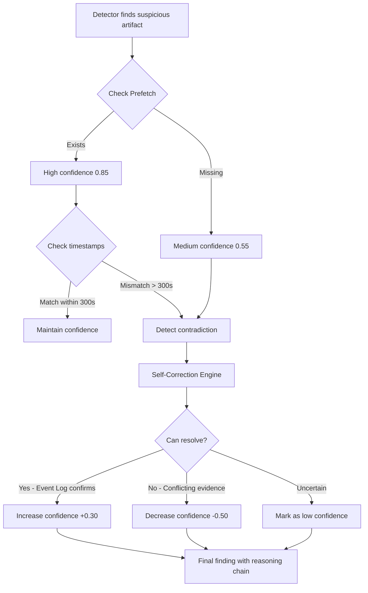
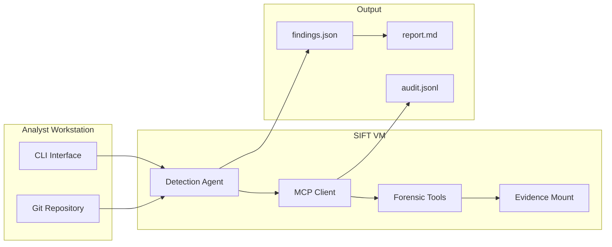

# SIFT Find Evil - Architecture Diagram

## System Architecture



## Data Flow



## Self-Correction Flow



## Component Responsibilities

### MCP Client
- **Read-only enforcement**: Blocks `--write`, `--modify`, `--delete` flags
- **Timeout guards**: Default 300s, configurable per tool
- **Circuit breaker**: Max 3 consecutive failures before halt
- **Audit logging**: Append-only JSONL with SHA-256 hashing

### Detection Engine
- **12 Detectors**: Ransomware, timestomping, persistence, exfiltration, etc.
- **Cross-artifact validation**: Correlate MFT, Prefetch, Registry, Event Logs
- **Confidence scoring**: Evidence-based, 0.0-1.0 range
- **MITRE ATT&CK mapping**: Technique classification

### Self-Correction Engine
- **Contradiction detection**: Timestamp mismatches, missing artifacts
- **Resolution strategies**: Lower confidence, flag uncertainty, seek additional evidence
- **Reasoning chains**: Documented decision logic preserved in findings
- **Confidence adjustment**: Penalty/recovery based on evidence quality

## Technology Stack

| Layer | Technology |
|-------|-----------|
| **Agent Framework** | Claude Code (Anthropic) |
| **MCP Integration** | Custom Python client with safety guards |
| **Forensic Tools** | MFTECmd, PECmd, EvtxECmd, Volatility 3 |
| **Platform** | SANS SIFT Workstation (Ubuntu 22.04) |
| **Language** | Python 3.12+ |
| **Logging** | Append-only JSONL |
| **Testing** | pytest (80%+ coverage, F1=1.00 validation) |
| **License** | MIT Open Source |

## Safety Guarantees

1. **Evidence integrity preserved**
   - All mounts read-only
   - No write operations allowed
   - Original evidence SHA-256 verified

2. **Chain-of-custody maintained**
   - Every tool invocation logged
   - Timestamps + command + exit code + output hash
   - Reproducible from audit logs

3. **No hallucinations**
   - All findings traceable to artifacts
   - Confidence scores reflect evidence quality
   - Contradictions flagged, not hidden

4. **Resource limits enforced**
   - Timeout prevents runaway processes
   - Circuit breaker prevents cascading failures
   - Memory/CPU limits configurable

## Deployment Architecture



## Scalability Considerations

**Current (Hackathon MVP):**
- Single case processing
- Local SIFT VM execution
- Manual case initialization

**Future (Production):**
- Multi-case queue with priority
- Distributed MCP servers for parallel tool execution
- Persistent learning: IoC database across cases
- Web UI for live monitoring
- Team collaboration features

---

## Visual Export Instructions

To generate PNG/SVG from this Mermaid diagram:

**Option 1: GitHub/GitLab** (renders automatically)
- Push this file to repository
- View on GitHub - Mermaid renders natively

**Option 2: Mermaid Live Editor**
1. Visit https://mermaid.live/
2. Paste diagram code
3. Export as PNG or SVG

**Option 3: Command Line**
```bash
npm install -g @mermaid-js/mermaid-cli
mmdc -i ARCHITECTURE_DIAGRAM.md -o architecture.png
```

**Option 4: VS Code**
- Install "Markdown Preview Mermaid Support" extension
- Preview this file
- Right-click diagram → Save as PNG

---

**Note for Judges:** This architecture diagram shows the complete system design. Key innovations:
1. MCP safety layer enforces constraints architecturally (not via prompts)
2. Self-correction engine detects contradictions in real-time
3. Audit trail provides complete chain-of-custody
4. All components open source and reproducible
