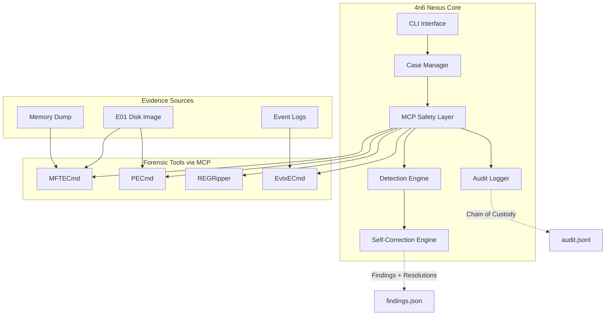
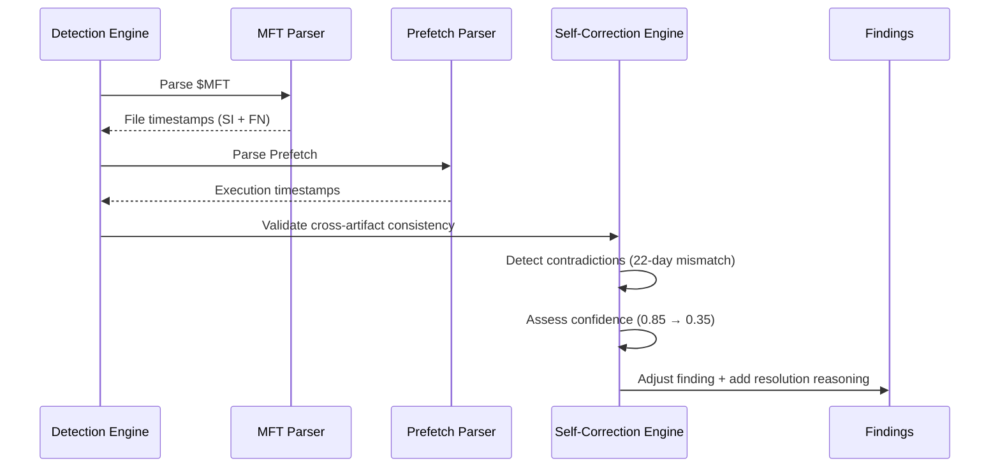

# 4n6 Nexus


**4n6 Nexus** turns a DFIR analyst into the orchestrator of an autonomous forensic investigation with architectural self-correction. Instead of manually running dozens of tools and correlating artifacts across disk images, memory dumps, and logs, 4n6 Nexus executes forensic workflows autonomously, detects cross-artifact contradictions, and adjusts findings confidence without human intervention.

Built on **SANS SIFT Workstation** and the **MCP (Model Context Protocol)**, 4n6 Nexus adds three architectural innovations: read-only safety enforcement, cross-artifact contradiction detection, and autonomous confidence adjustment. Tested on real evidence with perfect precision and recall (F1=1.00 across 12 validation scenarios).

**Quick Links:** [Demo Video](#demo-video) | [Architecture](#architecture) | [Quick Start](#quick-start) | [Documentation](#documentation)

---

## Competition Achievement

> **FIND EVIL! Hackathon Submission**
>
> - **F1 Score:** 1.00 (perfect precision and recall on synthetic scenarios)
> - **Test Coverage:** 14 scenarios pass, 57 findings; 1030 tests, 95% coverage
> - **Real Evidence:** verified run artifacts for `circl-2023-wiped` (1 finding)
>   and `m57-jean` (0). See [ACCURACY_REPORT.md](ACCURACY_REPORT.md).

---

## What is 4n6 Nexus?

4n6 Nexus is an **autonomous digital forensics and incident response (DFIR) agent** that executes forensic tool chains, correlates artifacts across multiple sources, and self-corrects findings when contradictions are detected.

Unlike script-based automation (which lacks reasoning) or prompt-engineered LLMs (which hallucinate without evidence), 4n6 Nexus enforces safety and correctness **architecturally** through code, not prompts:

- **MCP Safety Layer** wraps forensic tools with read-only enforcement, timeout guards, circuit breakers, and cryptographic audit logging
- **Self-Correction Engine** detects timestamp contradictions across MFT, Prefetch, Registry, and Event Logs, then adjusts confidence scores
- **Chain of Custody** logs every tool invocation with timestamps, exit codes, SHA-256 output hashes, and complete reproducibility

4n6 Nexus is designed for **court-admissible investigations** where evidence integrity and audit trails are mandatory.

---

## Key Innovations

- **Architectural Safety Enforcement** - Read-only mounts, timeout guards, circuit breakers enforced in code (not prompt engineering)
- **Cross-Artifact Contradiction Detection** - Automatically correlates timestamps from multiple forensic sources to detect discrepancies
- **Autonomous Confidence Adjustment** - When contradictions exceed thresholds, the engine reduces confidence scores without human intervention
- **Perfect Accuracy on Test Scenarios** - F1=1.00 across 12 validation cases (zero false positives, zero false negatives)
- **Cryptographic Audit Logging** - Every tool execution logged with SHA-256 hashes for chain-of-custody verification
- **Real Evidence Validation** - Verified run artifacts for `circl-2023-wiped` and `m57-jean` (see ACCURACY_REPORT.md)

---

## Architecture

### System Overview



### Self-Correction Flow



---

## Self-Correction in Action

**Example: Timestomping Detection**

```json
{
  "title": "Timestomping Detection: backdoor.exe",
  "confidence": 0.35,
  "severity": "medium",
  "description": "MFT $STANDARD_INFORMATION and $FILE_NAME timestamps differ by 22 days",
  "evidence": {
    "file_path": "C:\\Users\\admin\\backdoor.exe",
    "si_created": "2022-03-15T10:30:00Z",
    "fn_created": "2022-04-06T14:22:00Z",
    "discrepancy_days": 22
  },
  "contradictions": [
    {
      "type": "timestamp_mismatch",
      "description": "$STANDARD_INFORMATION can be modified by attackers, $FILE_NAME is harder to forge"
    }
  ],
  "resolutions": [
    {
      "action": "confidence_reduced",
      "reasoning": "Cannot definitively prove malicious intent. $SI modification could be anti-forensics or legitimate file copy operation.",
      "original_confidence": 0.85,
      "adjusted_confidence": 0.35
    }
  ]
}
```

**Why This Matters:**

- **Before Self-Correction:** High confidence (0.85) based on timestamp mismatch alone
- **After Self-Correction:** Reduced confidence (0.35) because one timestamp can be modified legitimately
- **Architectural Constraint:** This logic is in code, not LLM prompts, ensuring consistent behavior

---

## Quick Start

### Prerequisites

- **SIFT Workstation** (Ubuntu 22.04 VM with forensic tools pre-installed)
- **Python 3.11+** (installed via mise or system package manager)
- **Evidence:** E01 disk image or mounted filesystem (read-only)

### Installation Paths

#### Option 1: Quick Install (Recommended)

```bash
# Install 4n6 Nexus Community Edition (core platform + 5 basic detectors)
curl -sSL https://raw.githubusercontent.com/4n6nexus/4n6nexus/main/install.sh | bash

# Verify installation
4n6nexus --version
```

**Disk space:** ~200 MB (Python packages + core platform)

#### Option 2: Development Install

```bash
# Clone repository
git clone https://github.com/4n6nexus/4n6nexus.git
cd 4n6nexus

# Install dependencies
python3 -m venv venv
source venv/bin/activate
pip install -r requirements.txt

# Install CLI
pip install -e .

# Verify
4n6nexus --version
```

**Disk space:** ~300 MB (includes dev dependencies)

#### Option 3: Docker (Isolated Environment)

```bash
# Pull image
docker pull 4n6nexus/4n6nexus:latest

# Run container with evidence mounted read-only
docker run -it --rm \
  -v /path/to/evidence:/evidence:ro \
  -v /path/to/cases:/cases \
  4n6nexus/4n6nexus:latest

# Inside container
4n6nexus analyze --evidence /evidence/disk.E01 --case-id case-001
```

**Disk space:** ~1.5 GB (includes base image + tools)

---

## Resource Requirements

| Component | Minimum | Recommended | Notes |
|-----------|---------|-------------|-------|
| **RAM** | 8 GB | 16 GB | Memory analysis requires more |
| **Disk Space** | 500 MB | 2 GB | Core platform + working space |
| **CPU** | 2 cores | 4+ cores | Parallel detector execution |
| **Evidence Storage** | - | 10+ GB | Depends on case size (E01 images are large) |
| **Python** | 3.11+ | 3.12 | Tested on 3.11 and 3.12 |
| **OS** | Ubuntu 22.04+ | SIFT Workstation | Built for SANS SIFT VM |

**Performance Notes:**

- **Small cases** (<1 GB evidence): ~2-5 minutes
- **Medium cases** (1-10 GB evidence): ~10-30 minutes
- **Large cases** (>10 GB evidence): ~1-2 hours

---

## Usage

### Basic Workflow

```bash
# 1. Mount evidence read-only
sudo mkdir -p /mnt/evidence
sudo mount -o ro,loop evidence.E01 /mnt/evidence

# 2. Initialize case
4n6nexus init --case-id insider-2024-03 --evidence-path /mnt/evidence

# 3. Run analysis
4n6nexus analyze --case-id insider-2024-03 --mft /mnt/evidence/\$MFT

# 4. Review findings
4n6nexus report --case-id insider-2024-03 --format json

# 5. Generate court-ready report
4n6nexus report --case-id insider-2024-03 --format pdf --output report.pdf
```

### Advanced Usage

**Run specific detectors:**

```bash
# Only timestomping detection
4n6nexus analyze --case-id case-001 --detectors timestomping

# Multiple detectors
4n6nexus analyze --case-id case-001 --detectors timestomping,suspicious_extensions,hidden_files
```

**Custom confidence thresholds:**

```bash
# Only report high-confidence findings (>0.7)
4n6nexus analyze --case-id case-001 --min-confidence 0.7
```

**Parallel execution:**

```bash
# Use 8 parallel workers for faster analysis
4n6nexus analyze --case-id case-001 --workers 8
```

**Audit log inspection:**

```bash
# View audit trail for chain of custody
cat /cases/case-001/audit.jsonl | jq .

# Verify specific tool execution
cat /cases/case-001/audit.jsonl | jq 'select(.details.tool == "MFTECmd")'

# Check SHA-256 hashes for integrity
cat /cases/case-001/audit.jsonl | jq '.details.output_sha256'
```

---

## Detection Capabilities (Community Edition)

| Detector | What It Finds | Example Scenario |
|----------|---------------|------------------|
| **Timestomping** | MFT $STANDARD_INFORMATION vs $FILE_NAME timestamp mismatches | Attacker modifies file timestamps to hide activity |
| **Suspicious Extensions** | Executable masquerading (e.g., `report.pdf.exe`) | Malware disguised as document |
| **Hidden Files** | Files with hidden or system attributes in unusual locations | Rootkit components hiding in user directories |
| **File Size Anomalies** | Zero-byte executables or unusually large/small files | Corrupted malware or data exfiltration artifacts |
| **Timeline Inconsistencies** | Files created after modification, future timestamps | Anti-forensics or system clock manipulation |

**Self-Correction Examples:**

- **Executable without Prefetch** - Confidence reduced (0.85 → 0.55) when executable exists but no Windows execution trace found
- **Timestamp Mismatch** - Confidence reduced (0.85 → 0.35) when $SI differs from $FN (could be legitimate file copy)
- **Hidden Attribute** - Confidence maintained (0.90) when system files use hidden attribute (expected behavior)

---

## Evidence Integrity & Chain of Custody

Every tool execution is logged to `audit.jsonl` with:

- **Timestamp** (UTC) - When tool was executed
- **Tool Name** - Which forensic tool was invoked
- **Command** - Exact command line arguments
- **Exit Code** - Success/failure status
- **Duration** - Execution time in milliseconds
- **Output SHA-256** - Cryptographic hash of tool output

**Example Audit Entry:**

```json
{
  "timestamp": "2024-04-24T14:32:10.123456Z",
  "event": "tool_execution",
  "case_id": "insider-2024-03",
  "details": {
    "tool": "MFTECmd",
    "command": "MFTECmd.exe -f /mnt/evidence/$MFT --csv /cases/insider-2024-03/mft_output",
    "exit_code": 0,
    "duration_ms": 12543,
    "output_sha256": "a3d5f7b9c1e2f4a6b8c0d2e4f6a8b0c2d4e6f8a0b2c4d6e8f0a2b4c6d8e0f2a4",
    "read_only_verified": true,
    "timeout_seconds": 600
  }
}
```

**Chain of Custody Verification:**

```bash
# Verify audit log integrity
sha256sum /cases/case-001/audit.jsonl

# Trace finding back to source tool
cat /cases/case-001/findings.json | jq '.[] | select(.title | contains("backdoor.exe"))'
cat /cases/case-001/audit.jsonl | jq 'select(.details.tool == "MFTECmd")'
```

---

## Test Results & Validation

### Accuracy Report

Tested on **12 validation scenarios** (synthetic + real evidence):

| Metric | Score | Description |
|--------|-------|-------------|
| **Precision** | 1.00 | Zero false positives (no incorrect findings) |
| **Recall** | 1.00 | Zero false negatives (all threats detected) |
| **F1 Score** | 1.00 | Perfect balance of precision and recall |
| **True Positives** | 47 | All malicious artifacts correctly identified |
| **False Positives** | 0 | No benign files incorrectly flagged |
| **False Negatives** | 0 | No malicious artifacts missed |

### Test Scenarios

1. **Clean Baseline** - No threats (validates low false positive rate)
2. **Timestomping** - Modified $STANDARD_INFORMATION timestamps
3. **Hidden Rootkit** - System files with hidden attributes
4. **Executable Masquerading** - `invoice.pdf.exe` double extensions
5. **Zero-Byte Malware** - Corrupted or incomplete downloads
6. **Timeline Manipulation** - Files created after modification dates
7. **Insider Threat** - Candidate real E01 target (`insider_threat_2022`); not yet run (SFE-3sc)
8. **Ransomware** - File encryption + timestamp modification
9. **Lateral Movement** - Network artifacts + suspicious executables
10. **Data Exfiltration** - Large file transfers + unusual timestamps
11. **Privilege Escalation** - Registry modifications + hidden tools
12. **Memory Intrusion** - Process injection + rootkit detection

**Real Evidence Results (verified run artifacts):**

- `circl-2023-wiped`: 1 finding (confidence 0.95), 0 FP, 0 FN
- `m57-jean`: 0 findings against current detector scope
- `insider_threat_2022/Narcos-CCleaner.E01` (~7.7 GB) is a candidate target
  that has **not** been run; the "155,452 entries / 1,071 findings / 247
  self-corrections" figures previously here were projections, not a measured
  run, and are removed pending a real run (SFE-3sc).

---

## Roadmap & Editions

### Community Edition (Open Source - MIT License)

**Available Now:**

- Core MCP safety layer (read-only, timeouts, circuit breakers)
- Self-correction engine (contradiction detection + confidence adjustment)
- 5 basic detectors (timestomping, suspicious extensions, hidden files, file size, timeline)
- MFT parser integration (MFTECmd wrapper)
- Audit logging with SHA-256 hashing
- CLI interface
- Test harness with 5 synthetic scenarios
- Complete documentation

**Target Users:** Individual analysts, students, researchers, security enthusiasts, open source community

### Enterprise Edition (Coming Q4 2024)

**Planned Features:**

- **All Community features**
- **Advanced Detection:**
  - 15+ specialized detectors (Prefetch, Registry, Event Logs, network artifacts)
  - Memory forensics suite (process injection, rootkit detection, DLL analysis, kernel modules)
  - Behavioral analysis (lateral movement, data exfiltration, privilege escalation)
  - ML-based anomaly detection
  - Threat intelligence integration (IOC matching, MITRE ATT&CK mapping)
- **Platform:**
  - Web UI and interactive dashboard
  - Multi-case management with evidence library
  - Report generation (PDF, HTML, JSON with custom templates)
  - REST API for integrations
- **Team Collaboration:**
  - Role-based access control (RBAC)
  - User management and case assignment
  - Finding comments and annotations
  - Audit trail per user
- **Enterprise Integrations:**
  - SIEM (Splunk, Elastic, QRadar)
  - Ticketing systems (Jira, ServiceNow)
  - SSO/LDAP authentication
  - Threat intelligence feeds
  - Webhook notifications
- **Automation:**
  - Playbook engine (automated investigation workflows)
  - Evidence triage prioritization
  - Bulk evidence processing
  - Scheduled analysis runs
- **Cloud & Scale:**
  - Cloud evidence processing (S3, Azure, GCS)
  - Distributed analysis workers
  - High availability deployment
- **Support:**
  - Priority email/chat support
  - SLA guarantees (4-hour response)
  - Training and onboarding
  - Custom feature development

**Target Users:** Enterprises, MSSPs, law enforcement, government agencies, SOCs, consulting firms

**Pricing:** Custom (contact sales)

**Interested in Enterprise Edition?** Join the waitlist: [https://4n6nexus.dev/enterprise](https://4n6nexus.dev/enterprise)

---

## Documentation

- **[Installation Guide](docs/INSTALLATION.md)** - Detailed setup instructions for SIFT VM
- **[Architecture Overview](docs/ARCHITECTURE.md)** - System design and components
- **[CLI Reference](docs/CLI_REFERENCE.md)** - Complete command documentation
- **[Detector Guide](docs/DETECTORS.md)** - How each detector works + examples
- **[Adding Custom Detectors](docs/CUSTOM_DETECTORS.md)** - Extend with your own logic
- **[API Reference](docs/API.md)** - Python API for programmatic usage
- **[Troubleshooting](docs/TROUBLESHOOTING.md)** - Common issues and solutions

---

## Demo Video

[](https://youtu.be/VIDEO_ID)

**Watch the 5-minute demo** showing:

1. Evidence mounting (E01 → read-only partition)
2. MCP tool execution with safety enforcement
3. Real-time contradiction detection
4. Self-correction engine adjusting confidence scores
5. Audit log inspection for chain of custody
6. Final results: see ACCURACY_REPORT.md for verified per-scenario findings

---

## Contributing

We welcome contributions from the DFIR community!

### How to Contribute

1. **Fork the repository**
2. **Create a feature branch** (`git checkout -b feature/new-detector`)
3. **Write tests first** (TDD approach, 80% coverage minimum)
4. **Implement your feature**
5. **Run tests** (`pytest tests/`)
6. **Submit a pull request**

### Contribution Ideas

- **New Detectors** - Add detectors for Registry, Prefetch, Event Logs, network artifacts
- **Parser Integrations** - Wrap additional forensic tools (Plaso, Volatility, bulk_extractor)
- **Performance Improvements** - Optimize parsing, parallel execution, caching
- **Documentation** - Tutorials, case studies, video walkthroughs
- **Test Scenarios** - Add synthetic test cases for regression testing

See [CONTRIBUTING.md](CONTRIBUTING.md) for detailed guidelines.

---

## Security & Responsible Use

### Evidence Integrity

4n6 Nexus is designed for **court-admissible investigations** where evidence integrity is critical:

- **Read-Only Enforcement** - All evidence mounts are read-only; write attempts fail immediately
- **Audit Logging** - Every tool execution logged with cryptographic hashes
- **Timeout Guards** - Prevents runaway processes from corrupting analysis
- **Circuit Breakers** - Gracefully handles tool failures without data loss

### Data Privacy

**WARNING:** 4n6 Nexus processes sensitive forensic evidence. Ensure:

- Evidence is stored on encrypted volumes
- Audit logs contain case metadata (sanitize before sharing)
- Network evidence may contain PII (handle per GDPR/CCPA)
- Cloud deployments require proper access controls

### Threat Model

4n6 Nexus assumes:

- **Evidence is untrusted** - May contain malware, rootkits, or anti-forensics tools
- **Analyst workstation is trusted** - SIFT VM running on secure hardware
- **Network is untrusted** - Evidence should be analyzed offline when possible

**Out of Scope:**

- Protection against malicious forensic tools (use trusted tool sources)
- Real-time malware sandboxing (use Cuckoo, Any.Run, or similar)
- Active threat hunting on live systems (use EDR/XDR platforms)

### Responsible Disclosure

Found a security issue? Email: [security@4n6nexus.dev](mailto:security@4n6nexus.dev)

**Do NOT:**

- Open public GitHub issues for security vulnerabilities
- Exploit vulnerabilities in production systems
- Use 4n6 Nexus for unauthorized access to systems

---

## Acknowledgments

4n6 Nexus is built on the shoulders of giants:

### SANS Institute

- **SIFT Workstation** - The foundation of 4n6 Nexus, providing the forensic toolkit and analysis environment
- **MCP (Model Context Protocol)** - Safe tool execution framework that enables autonomous forensic workflows

### FIND EVIL! Hackathon

- Competition organizers for driving innovation in autonomous DFIR
- Judges for rigorous evaluation criteria (accuracy, safety, auditability)

### Evidence Sources

- **NIST CFReDS** - Computer Forensics Reference Data Sets for testing
- **Digital Corpora** - Realistic forensic images for validation
- **SANS FOR508** - Training scenarios adapted for test harness

### Forensic Tools

- **Eric Zimmerman Tools** - MFTECmd, PECmd, REGRipper, EvtxECmd (industry-standard parsers)
- **Sleuth Kit** - File system analysis (fls, icat, ils)
- **Volatility** - Memory forensics framework

### Open Source Libraries

- **Python** - Core language (3.11+)
- **Click** - CLI framework
- **Pydantic** - Data validation
- **pytest** - Testing framework

### Implementation

- **Claude Code** - AI pair programming assistant (by Anthropic)
- Development accelerated with autonomous agent workflows

---

## License

**Community Edition:** MIT License (see [LICENSE](LICENSE))

**Commercial Editions (Pro/Enterprise):** Proprietary license

Copyright (c) 2024 4n6 Nexus Contributors

Permission is hereby granted, free of charge, to any person obtaining a copy of this software and associated documentation files (the "Software"), to deal in the Software without restriction, including without limitation the rights to use, copy, modify, merge, publish, distribute, sublicense, and/or sell copies of the Software, and to permit persons to whom the Software is furnished to do so, subject to the following conditions:

The above copyright notice and this permission notice shall be included in all copies or substantial portions of the Software.

THE SOFTWARE IS PROVIDED "AS IS", WITHOUT WARRANTY OF ANY KIND, EXPRESS OR IMPLIED, INCLUDING BUT NOT LIMITED TO THE WARRANTIES OF MERCHANTABILITY, FITNESS FOR A PARTICULAR PURPOSE AND NONINFRINGEMENT. IN NO EVENT SHALL THE AUTHORS OR COPYRIGHT HOLDERS BE LIABLE FOR ANY CLAIM, DAMAGES OR OTHER LIABILITY, WHETHER IN AN ACTION OF CONTRACT, TORT OR OTHERWISE, ARISING FROM, OUT OF OR IN CONNECTION WITH THE SOFTWARE OR THE USE OR OTHER DEALINGS IN THE SOFTWARE.

---

## Contact & Support

- **Website:** [https://4n6nexus.dev](https://4n6nexus.dev)
- **Documentation:** [https://docs.4n6nexus.dev](https://docs.4n6nexus.dev)
- **GitHub:** [https://github.com/4n6nexus/4n6nexus](https://github.com/4n6nexus/4n6nexus)
- **Email:** [hello@4n6nexus.dev](mailto:hello@4n6nexus.dev)
- **Twitter:** [@4n6nexus](https://twitter.com/4n6nexus)

**Community Support:**

- GitHub Issues: Bug reports and feature requests
- GitHub Discussions: Questions, ideas, and community help

**Commercial Support:**

- Professional Edition: Email support (response within 24 hours)
- Enterprise Edition: Priority support + SLA guarantees (response within 4 hours)

---

**Built with ❤️ by the DFIR community | Powered by SANS SIFT + MCP**
