# START HERE - Documentation Navigation Guide

**Welcome to 4n6 Nexus** (submitted to SANS FIND EVIL! as *SIFT Find Evil*; code module `sift_find_evil`)**!**

This repository contains **73 documentation files** organized for different audiences. This guide helps you find what you need quickly.

---

## Documentation Map

```mermaid
graph TD
    START[👋 START HERE] --> README[📖 README.md<br/>Project Overview]
    
    README --> JUDGE{🎯 I am a...}
    
    JUDGE --> HACKATHON[Hackathon Judge]
    JUDGE --> USER[DFIR Analyst / User]
    JUDGE --> DEV[Developer / Contributor]
    JUDGE --> RESEARCH[Researcher]
    
    HACKATHON --> H1[ACCURACY_REPORT.md<br/>Detection Metrics]
    HACKATHON --> H2[ARCHITECTURE.md<br/>System Design]
    HACKATHON --> H3[SUBMISSION_CHECKLIST.md<br/>Deliverables Status]
    HACKATHON --> H4[demo video link<br/>Live Demo]
    
    USER --> U1[CLI_USAGE.md<br/>Command Reference]
    USER --> U2[EXAMPLES.md<br/>Real-World Cases]
    USER --> U3[DATASETS.md<br/>Test Data]
    USER --> U4[DEPLOY_TO_SIFT.md<br/>Installation]
    
    DEV --> D1[CONTRIBUTING.md<br/>Dev Guide]
    DEV --> D2[BATCH_TESTING.md<br/>Testing Approach]
    DEV --> D3[ARCHITECTURE.md<br/>Component Design]
    DEV --> D4[DOCUMENTATION_INDEX.md<br/>All Docs]
    
    RESEARCH --> R1[SELF_CORRECTION.md<br/>Algorithm Details]
    RESEARCH --> R2[DETECTION_TAXONOMY.md<br/>Finding Categories]
    RESEARCH --> R3[ADVERSARIAL_VALIDATOR_DESIGN.md<br/>Validation Logic]
    RESEARCH --> R4[PRD.md<br/>Product Vision]
    
    style START fill:#f9f,stroke:#333,stroke-width:4px
    style HACKATHON fill:#bfb,stroke:#333,stroke-width:2px
    style USER fill:#bbf,stroke:#333,stroke-width:2px
    style DEV fill:#fbb,stroke:#333,stroke-width:2px
    style RESEARCH fill:#ffb,stroke:#333,stroke-width:2px
```



---

## Quick Navigation by Role

### 🎯 Hackathon Judges (10-Minute Evaluation)

**Goal:** Understand project quality, accuracy, and innovation.

**Read in this order:**

1. **[../README.md](../README.md)** (5 min)
   - Detection accuracy table (F1=1.00)
   - Self-correction example
   - Architecture overview

2. **[ACCURACY_REPORT.md](ACCURACY_REPORT.md)** (2 min)
   - Precision/recall methodology
   - Per-scenario breakdowns
   - Validation approach

3. **[ARCHITECTURE.md](ARCHITECTURE.md)** (3 min)
   - Component architecture
   - Self-correction engine design
   - Data flow diagrams

**Also review:**
- **[../SUBMISSION_CHECKLIST.md](../SUBMISSION_CHECKLIST.md)** - All deliverables status
- **Demo video** - Live terminal execution (link in submission)
- **Audit logs** - `/cases/*/analysis/audit.jsonl` (traceability)

**Key metrics to note:**
- F1 Score: **1.00** (perfect precision and recall)
- Scenarios: **12/12 passing** (47 true positives, 0 false positives/negatives)
- Test coverage: **85%**
- Self-correction instances: **247** from real evidence

---

### 👨‍💼 DFIR Analysts / Users

**Goal:** Analyze forensic evidence and understand capabilities.

**Start here:**

1. **[../README.md](../README.md)** - Project overview and quick start
2. **[CLI_USAGE.md](CLI_USAGE.md)** - Command-line reference
3. **[EXAMPLES.md](EXAMPLES.md)** - Real-world case walkthroughs
4. **[../DEPLOY_TO_SIFT.md](../DEPLOY_TO_SIFT.md)** - SIFT Workstation deployment

**For specific tasks:**

| Task | Document |
|------|----------|
| Analyze disk image | [EXAMPLES.md](EXAMPLES.md) - M57 Jean case |
| Analyze memory dump | [CLI_USAGE.md](CLI_USAGE.md) - Memory analysis section |
| Use YARA rules | [CLI_USAGE.md](CLI_USAGE.md) - YARA scanning |
| Understand findings | [DETECTION_TAXONOMY.md](DETECTION_TAXONOMY.md) - Finding categories |
| Case management | [../README.md](../README.md) - Case workflow section |
| Approve/reject findings | [../README.md](../README.md) - Approval workflow |

**Supported artifacts:**
- **Windows:** MFT, Prefetch, Event Logs, Registry, LNK files, Jump Lists
- **Memory:** Volatility 3 (pslist, malfind, netscan, cmdline)
- **Network:** PCAP, browser history, webmail
- **Malware:** YARA, NSRL filtering

---

### 👨‍💻 Developers / Contributors

**Goal:** Extend functionality, add detectors, fix bugs.

**Essential reading:**

1. **[CONTRIBUTING.md](CONTRIBUTING.md)** - Development setup, coding standards, PR workflow
2. **[ARCHITECTURE.md](ARCHITECTURE.md)** - Component architecture and extension points
3. **[BATCH_TESTING.md](../BATCH_TESTING.md)** - Testing requirements (80% coverage)
4. **[DOCUMENTATION_INDEX.md](DOCUMENTATION_INDEX.md)** - Complete docs map

**By task:**

| I want to... | Read this |
|--------------|-----------|
| Add a new detector | [ARCHITECTURE.md](ARCHITECTURE.md) - "Adding a New Detector" |
| Add a new parser | [ARCHITECTURE.md](ARCHITECTURE.md) - "Adding a New Parser" |
| Add a contradiction type | [ARCHITECTURE.md](ARCHITECTURE.md) - "Adding a New Contradiction Type" |
| Understand test infrastructure | [BATCH_TESTING.md](../BATCH_TESTING.md), [REGRESSION_TESTING.md](../REGRESSION_TESTING.md) |
| Run CI/CD checks locally | [CONTRIBUTING.md](CONTRIBUTING.md) - Quality checks section |
| Understand code structure | [ARCHITECTURE.md](ARCHITECTURE.md) - Module reference |
| Work with MCP servers | [MCP_INTEGRATION.md](MCP_INTEGRATION.md) - Protocol SIFT integration |

**Code quality requirements:**
- PEP 8 compliance (ruff, black)
- Type hints on all functions
- 80% test coverage minimum
- All tests passing before PR

**Project structure:**
```
sift_find_evil/
├── parsers/          # Artifact ingestion (MFT, Prefetch, etc.)
├── detectors/        # Pattern recognition
├── self_correction/  # Contradiction detection + resolution
├── findings/         # Finding dataclass (REFACTORED 2026-04-26)
├── approval/         # Human-in-the-loop workflow
├── case/             # Case management
├── audit/            # Audit logging
├── reporting/        # Report generation
└── cli.py            # CLI entry point (1,700+ lines)
```

---

### 🔬 Researchers

**Goal:** Understand algorithms, self-correction logic, innovation.

**Deep dive docs:**

1. **[SELF_CORRECTION.md](SELF_CORRECTION.md)** - Self-correction algorithm detailed walkthrough
2. **[ARCHITECTURE.md](ARCHITECTURE.md)** - System architecture and design patterns
3. **[ADVERSARIAL_VALIDATOR_DESIGN.md](ADVERSARIAL_VALIDATOR_DESIGN.md)** - Validation logic
4. **[DETECTION_TAXONOMY.md](DETECTION_TAXONOMY.md)** - Finding categorization system
5. **[PRD.md](PRD.md)** - Product vision and requirements

**Algorithm details:**

| Algorithm | Document | Key Concepts |
|-----------|----------|--------------|
| Self-correction engine | [SELF_CORRECTION.md](SELF_CORRECTION.md) | Contradiction detection, resolution strategies, confidence scoring |
| Timestamp comparison | [ARCHITECTURE.md](ARCHITECTURE.md) | Causality violations, timestomping detection |
| Exfiltration detection | [ARCHITECTURE.md](ARCHITECTURE.md) | SHA-256 correlation, temporal proximity |
| Disk wipe detection | [ARCHITECTURE.md](ARCHITECTURE.md) | GPT backup analysis |
| Confidence scoring | [ARCHITECTURE.md](ARCHITECTURE.md) | Bayesian adjustment, contradiction penalties |

**Research topics:**
- **Cross-artifact validation** - How MFT, Prefetch, Event Logs resolve conflicts
- **Architectural constraints** - Read-only enforcement, circuit breakers, timeouts
- **Adversarial testing** - Bypass attempts, constraint validation
- **Artifact-centric detection** - No file names, no user names, only cryptographic/temporal signals

**Performance characteristics:**
- CSV-only analysis: 4-6 seconds (91K MFT entries)
- Disk image + hashing: 4.2 minutes (228 files)
- Memory usage: 60 MB (without NSRL), 3.2 GB (with NSRL)

---

## Documentation Categories

### Core Documentation (Start Here)

| Document | Description | Audience |
|----------|-------------|----------|
| [../README.md](../README.md) | Project overview, features, quick start | Everyone |
| [ARCHITECTURE.md](ARCHITECTURE.md) | System design, components, data flow | Judges, Developers, Researchers |
| [ACCURACY_REPORT.md](ACCURACY_REPORT.md) | Detection metrics, validation methodology | Judges, Researchers |
| [../SUBMISSION_CHECKLIST.md](../SUBMISSION_CHECKLIST.md) | Hackathon deliverables status | Judges |

### User Guides

| Document | Description |
|----------|-------------|
| [CLI_USAGE.md](CLI_USAGE.md) | Command-line interface reference |
| [EXAMPLES.md](EXAMPLES.md) | Real-world case walkthroughs (M57 Jean, etc.) |
| [DATASETS.md](DATASETS.md) | Test datasets and evidence sources |
| [../DEPLOY_TO_SIFT.md](../DEPLOY_TO_SIFT.md) | SIFT Workstation deployment guide |
| [../INSTALL_SIFT.md](../INSTALL_SIFT.md) | SIFT installation instructions |

### Developer Guides

| Document | Description |
|----------|-------------|
| [CONTRIBUTING.md](CONTRIBUTING.md) | Development setup, coding standards, PR workflow |
| [../BATCH_TESTING.md](../BATCH_TESTING.md) | Systematic testing approach |
| [../REGRESSION_TESTING.md](../REGRESSION_TESTING.md) | Regression testing setup |
| [DOCUMENTATION_INDEX.md](DOCUMENTATION_INDEX.md) | Complete documentation map (all 73 files) |

### Technical Deep Dives

| Document | Description |
|----------|-------------|
| [SELF_CORRECTION.md](SELF_CORRECTION.md) | Self-correction algorithm details |
| [DETECTION_TAXONOMY.md](DETECTION_TAXONOMY.md) | Finding categories and taxonomy |
| [ADVERSARIAL_VALIDATOR_DESIGN.md](ADVERSARIAL_VALIDATOR_DESIGN.md) | Validation logic and bypass testing |
| [ERROR_HANDLING_ARCHITECTURE.md](ERROR_HANDLING_ARCHITECTURE.md) | Error handling system design |

### Integration Guides

| Document | Description |
|----------|-------------|
| [MCP_INTEGRATION.md](MCP_INTEGRATION.md) | Model Context Protocol integration |
| [NSRL_INTEGRATION.md](NSRL_INTEGRATION.md) | Known-good hash filtering |

### Planning & Strategy

| Document | Description |
|----------|-------------|
| [PRD.md](PRD.md) | Product Requirements Document |
| [OPEN_SOURCE_STRATEGY.md](OPEN_SOURCE_STRATEGY.md) | Open source approach |
| [DEVELOPMENT_TIMELINE.md](DEVELOPMENT_TIMELINE.md) | Phase-by-phase progress |
| [enterprise/](enterprise/) | Community/Enterprise split planning (6 docs) |

### Demo & Submission

| Document | Description |
|----------|-------------|
| [DEMO_RECORDING_VERIFIED.md](DEMO_RECORDING_VERIFIED.md) | Demo video script (5 min) - the verified, record-ready script (commands + numbers run live on the SIFT VM) |
| [../SUBMISSION_CHECKLIST.md](../SUBMISSION_CHECKLIST.md) | Hackathon checklist |

---

## Enterprise Edition Planning

**Location:** [docs/enterprise/](enterprise/)

The repository includes detailed planning for splitting into Community (open source) and Enterprise editions:

1. **[enterprise/README.md](enterprise/README.md)** - Overview and reading order
2. **[enterprise/DECISIONS.md](enterprise/DECISIONS.md)** - Strategic decisions (MPL-2.0, naming, versioning)
3. **[enterprise/CRITICAL_ARCHITECTURE_ISSUE.md](enterprise/CRITICAL_ARCHITECTURE_ISSUE.md)** - Finding refactor (RESOLVED ✅)
4. **[enterprise/SPLIT_CRITERIA.md](enterprise/SPLIT_CRITERIA.md)** - Community vs. Enterprise boundaries
5. **[enterprise/REPOSITORY_SPLIT_PRD.md](enterprise/REPOSITORY_SPLIT_PRD.md)** - Implementation plan
6. **[enterprise/DEPENDENCY_MAP.md](enterprise/DEPENDENCY_MAP.md)** - Architecture visualization

**Status:** All strategic decisions finalized. Finding refactor complete (commit 80fb97f). Split execution planned post-demo (May 2026).

**Product name:** 4n6 Nexus (forensics nexus)
- Community: MPL-2.0 license
- Enterprise: Proprietary, adds self-correction + MCP

---

## Complete Documentation Index

For a **complete list of all 73 documentation files**, see:

**[DOCUMENTATION_INDEX.md](DOCUMENTATION_INDEX.md)** - Comprehensive documentation map

---

## Tips for Navigating Documentation

### For Quick Evaluation (10 minutes)

1. Read [../README.md](../README.md) - Detection accuracy table + self-correction example
2. Skim [ACCURACY_REPORT.md](ACCURACY_REPORT.md) - Metrics
3. Skim [ARCHITECTURE.md](ARCHITECTURE.md) - Scroll to diagrams

### For Comprehensive Understanding (1-2 hours)

1. Read [../README.md](../README.md)
2. Read [ARCHITECTURE.md](ARCHITECTURE.md)
3. Read [SELF_CORRECTION.md](SELF_CORRECTION.md)
4. Read [EXAMPLES.md](EXAMPLES.md)
5. Browse [DOCUMENTATION_INDEX.md](DOCUMENTATION_INDEX.md) for topics of interest

### For Hands-On Testing (30 minutes)

1. Read [../README.md](../README.md) - Quick Start section
2. Run demo mode: `python -m sift_find_evil.cli demo`
3. Read [CLI_USAGE.md](CLI_USAGE.md) - Find commands for your use case
4. Try a complete workflow: [../README.md](../README.md) - Complete Workflow Example

---

## Visual Repository Structure

```
sift_find_evil/
├── README.md                    ← Start here
├── CLAUDE.md                    ← AI agent instructions
├── SUBMISSION_CHECKLIST.md      ← Hackathon deliverables
├── DEPLOY_TO_SIFT.md            ← Installation guide
├── BATCH_TESTING.md             ← Testing approach
├── REGRESSION_TESTING.md        ← Regression testing
│
├── docs/                        ← All documentation (73 files)
│   ├── START_HERE.md            ← You are here!
│   ├── DOCUMENTATION_INDEX.md   ← Complete docs map
│   ├── ARCHITECTURE.md          ← System design
│   ├── ACCURACY_REPORT.md       ← Detection metrics
│   ├── SELF_CORRECTION.md       ← Algorithm details
│   ├── CLI_USAGE.md             ← Command reference
│   ├── EXAMPLES.md              ← Real-world cases
│   ├── CONTRIBUTING.md          ← Dev guide
│   ├── enterprise/              ← Community/Enterprise split planning
│   └── ... (60+ more docs)
│
├── sift_find_evil/              ← Python package
│   ├── parsers/                 ← Artifact parsers
│   ├── detectors/               ← Detection modules
│   ├── self_correction/         ← Self-correction engine
│   ├── findings/                ← Finding dataclass (REFACTORED)
│   ├── approval/                ← Human-in-the-loop workflow
│   ├── case/                    ← Case management
│   ├── audit/                   ← Audit logging
│   ├── reporting/               ← Report generation
│   └── cli.py                   ← CLI entry point
│
├── tests/                       ← Test infrastructure
│   ├── scenario_harness.py      ← Automated validation
│   └── fixtures/                ← Synthetic test data
│
├── scenarios/                   ← Test scenarios
│   ├── synthetic/               ← 12 synthetic scenarios (F1=1.00)
│   └── real/                    ← Real evidence scenarios
│
└── cases/                       ← Case management directory
    └── {case_id}/               ← Per-case structure
        ├── evidence/            ← Evidence files
        ├── analysis/            ← Analysis outputs
        ├── reports/             ← Generated reports
        ├── findings.json        ← Detected findings
        └── audit.jsonl          ← Audit trail
```

---

## Common Questions

### "Where do I start?"

**It depends on who you are:**
- **Judge?** [../README.md](../README.md) → [ACCURACY_REPORT.md](ACCURACY_REPORT.md) → [ARCHITECTURE.md](ARCHITECTURE.md)
- **User?** [../README.md](../README.md) → [CLI_USAGE.md](CLI_USAGE.md) → [EXAMPLES.md](EXAMPLES.md)
- **Developer?** [CONTRIBUTING.md](CONTRIBUTING.md) → [ARCHITECTURE.md](ARCHITECTURE.md) → [BATCH_TESTING.md](../BATCH_TESTING.md)
- **Researcher?** [SELF_CORRECTION.md](SELF_CORRECTION.md) → [ARCHITECTURE.md](ARCHITECTURE.md) → [PRD.md](PRD.md)

### "How accurate is this tool?"

See [ACCURACY_REPORT.md](ACCURACY_REPORT.md) - **F1=1.00** (perfect precision and recall) across 12 test scenarios.

### "How does self-correction work?"

See [SELF_CORRECTION.md](SELF_CORRECTION.md) - Detailed algorithm walkthrough with examples.

### "How do I deploy this?"

See [../DEPLOY_TO_SIFT.md](../DEPLOY_TO_SIFT.md) - SIFT Workstation deployment guide.

### "Can I contribute?"

Yes! See [CONTRIBUTING.md](CONTRIBUTING.md) - Development setup, coding standards, PR workflow.

### "What's the roadmap?"

See [PRD.md](PRD.md) and [../README.md](../README.md) - Roadmap section (v1.0 complete, v2.0 planned, v3.0 future).

### "Where are the test results?"

- **Synthetic scenarios:** Run `PYTHONPATH=. python3 tests/scenario_harness.py`
- **Real evidence:** See `analysis/scenario_report.json`
- **Audit logs:** `/cases/*/analysis/audit.jsonl`

### "What evidence can it analyze?"

See [EVIDENCE_COMPATIBILITY.md](EVIDENCE_COMPATIBILITY.md) - Supported artifacts (MFT, Prefetch, Event Logs, Memory, PCAP, YARA, etc.).

---

## Document Status Legend

Throughout the documentation, you'll see status indicators:

- ✅ **Complete** - Production-ready
- ⏳ **In Progress** - Currently being implemented
- 📅 **Planned** - Future work
- 🚧 **Draft** - Work in progress
- ⚠️ **Deprecated** - Outdated, see newer version

---

## Need Help?

- **Issues:** https://github.com/Strike48/sift_find_evil/issues
- **Author:** Jonathan Tomek (jonathan.tomek@strike48.com)
- **GitHub:** https://github.com/Strike48/sift_find_evil

---

**Last Updated:** 2026-04-26  
**Repository Status:** Ready for demo recording (all deliverables complete except video)
